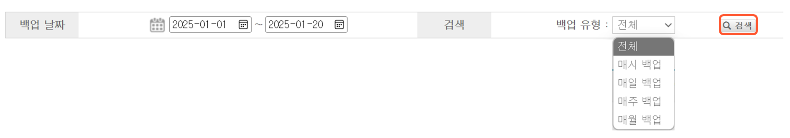

# BackupDoc - 백업관리자가 백업 로그 확인하는 방법

백업관리자는 BackupDoc 관리자 웹페이지에서 원본 서버의 백업 로그를 확인할 수 있습니다. 백업 로그는 백업 시작 시와 종료 시에 기록되며, 백업 종료 후에는 작업의 성공/실패 여부와 전송된 파일 수 및 용량을 확인할 수 있습니다.\
​\
1\.   백업관리자로 로그인한 후 **백업 로그**를 선택하면 백업이 실행된 모든 로그가 표시됩니다.

.png>) 2.   백업이 실행된 기간과 백업 유형을 검색 조건으로 하여 **검색**을 클릭하면 조건을 만족하는 백업 현황 목록이 표시됩니다.\
&#x20; 3.    다음과 같은 결과를 확인할 수 있습니다.

1. **작업 시간**: 백업이 실행된 날짜와 시간
2. **작업**: 백업 시작/백업 종료의 구분
3. **결과**: 백업의 성공/실패
4. **백업 유형**: 매시/매일/매주/매월 백업 주기
5. **작업 이름**: 백업 스케줄 설정 시 입력한 백업 스케줄 이름
6. **전송 파일 크기**: 전송된 백업 데이터의 용량
7. **파일 전송 수**: 백업된 파일 수
8. **메시지**: 기타 참고사항
