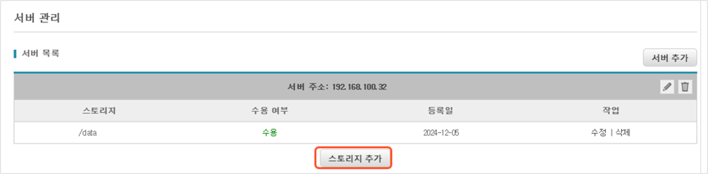
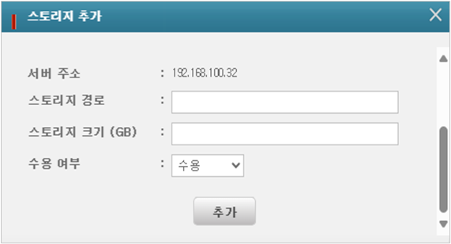
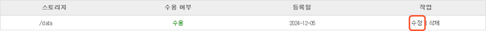
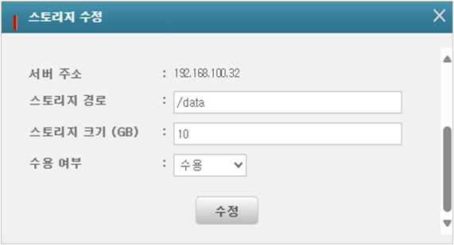
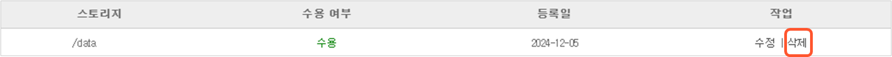

# BackupDoc - 슈퍼관리자가 백업 서버 관리하는 방법

슈퍼관리자는 BackupDoc 관리자 웹페이지의 **서버 관리** 메뉴에서 백업 서버와 각 서버의 스토리지를 등록, 수정, 삭제할 수 있습니다.

.png>)

#### <mark style="color:$primary;">서버 추가</mark>

1. 서버 관리 화면 상단의 **서버 추가** 버튼을 클릭하면 ‘서버 추가’ 창이 팝업됩니다.

<figure><figcaption></figcaption></figure>

2. **서버 주소** 입력칸에 추가하려는 백업 서버의 IP 주소를 입력하고 하단에 스토리지 경로, 크기 등 스토리지 정보를 입력합니다. **스토리지 추가** 버튼을 클릭하여 추가 스토리지 정보를 입력할 수 있으며, 스토리지 경로 앞의  버튼을 클릭하여 삭제할 수도 있습니다.

* **스토리지 경로**:  백업 서버에 스토리지가 마운트된 경로
* **스토리지 크기(GB)**:  스토리지 크기를 GB 단위로 입력
* **수용 여부**:  수용/수용 안함

3. 서버 주소와 스토리지 정보 입력이 끝나면 하단의 **추가** 버튼을 클릭합니다.

#### <mark style="color:$primary;">서버 수정</mark>

서버 관리 화면에서 서버 주소 우측의 수정 아이콘 .png>) 을 클릭하여 백업 서버의 주소를 수정할 수 있습니다.

.png>)

<figure><figcaption></figcaption></figure>

#### <mark style="color:$primary;">서버 삭제</mark>

서버 관리 화면에서 서버 주소 우측의 삭제 아이콘 .png>) 을 클릭하여 백업 서버를 삭제할 수 있습니다.

.png>)

#### <mark style="color:$primary;">스토리지 추가</mark>

서버 관리 화면에서 **스토리지 추가** 버튼을 통해 각 백업 서버에 스토리지를 추가할 수 있습니다.

<figure><figcaption></figcaption></figure>

다음을 입력한 후 **추가** 버튼을 클릭합니다.

* 서버 주소:  추가하려는 스토리지의 서버 경로
* 스토리지 경로:  추가되는 스토리지의 경로(실제 마운트 되는 스토리지의 경로)
* 스토리지 크기:  추가되는 스토리지의 크기 (GB)
* 수용 여부:  수용/수용 안함

#### <mark style="color:$primary;">스토리지 수정</mark>

서버 관리 화면에서 서버 주소 아래의 스토리지 목록에서 각 스토리지 우측에 있는 **수정**을 클릭하여 스토리지의 경로, 크기, 수용 여부를 수정할 수 있습니다.

<figure><figcaption></figcaption></figure>

<figure><figcaption></figcaption></figure>

#### <mark style="color:$primary;">스토리지 삭제</mark>

서버 관리 화면에서 서버 주소 아래의 스토리지 목록에서 각 스토리지 우측에 있는 **삭제**를 클릭하여 스토리지를 삭제할 수 있습니다.

