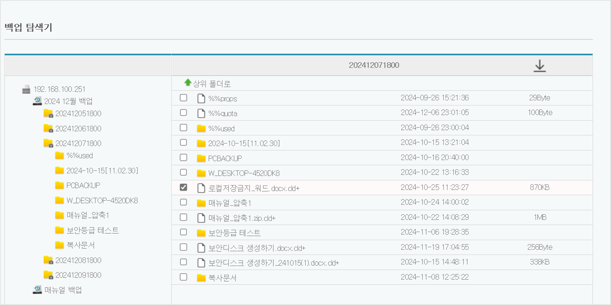
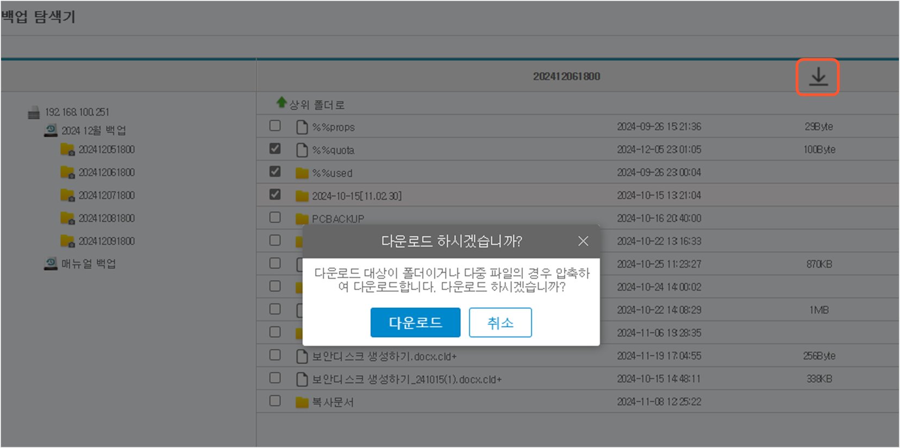
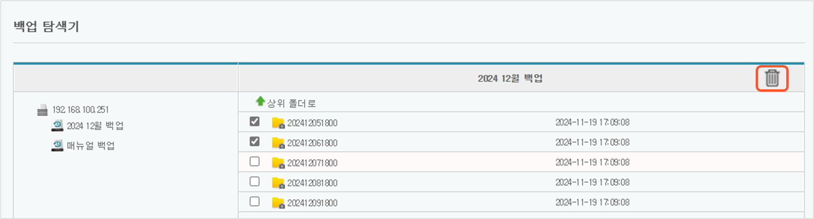

# BackupDoc - 문서중앙화 서버의 백업 탐색기 사용하기

BackupDoc을 사용하여 문서중앙화 서버를 백업할 경우, 서비스관리자 또는 정보보호관리자가 **백업 탐색기**에서 서버별, 백업 스케줄별로 백업된 파일/폴더의 목록을 조회하고, 복원이 필요한 파일/폴더를 다운로드할 수 있습니다. 또한 백업된 데이터를 스냅샷 단위로 삭제할 수 있습니다.\
&#x20;

### 백업된 파일/폴더 조회

관리자 웹페이지에서 **백업 모듈 관리 - BackupDoc – 백업 탐색기**를 클릭하면 서버별, 백업 스케줄별로 파일/폴더의 목록이 조회할 수 있습니다.탐색기의 좌측에는 백업 데이터의 폴더 트리가 표시됩니다. 원본 서버 폴더 하위에 백업 스케줄별로 폴더가 존재하며, 백업 시마다 백업 스케줄 폴더 하위에 스냅샷 폴더들이 생성됩니다.

1. .png>) 원본 서버 폴더: 원본 서버의 IP 주소로 구분
2. .png>) 백업 스케줄 폴더:  백업 스케줄 등록 시 입력한 스케줄 이름으로 구분
3. .png>) 스냅샷 폴더: 등록된 스케줄에 따라 백업된 스냅샷 폴더로 백업일시로 구분

좌측 트리에서 원하는 스냅샷 폴더를 선택하여 클릭하면 화면 우측에서 백업된 파일/폴더를 확인할 수 있습니다.  원하는 스냅샷 폴더를 선택하여 클릭하면 화면 우측에서 백업된 파일/폴더를 확인할 수 있습니다.\
​\

### 백업된 파일/폴더 다운로드

스냅샷 폴더 하위의 파일/폴더 단위로 다운로드가 가능하며, 스냅샷 폴더를 선택하여 다운로드할 수는 없습니다. 다운로드할 항목 좌측의 체크 박스를 하나 이상 선택하면 우측 상단에 다운로드 아이콘 이 활성화되고, 해당 아이콘을 클릭하면 선택한 파일/폴더가 다운로드 됩니다. 폴더 또는 다중 파일 다운로드의 경우 압축하여 다운로드가 진행됩니다.

 \
&#x20;

### 백업 삭제

백업 데이터를 삭제하고자 할 경우, 스냅샷 폴더를 선택하여 해당 스냅샷 전체를 삭제할 수 있으며, 스냅샷 폴더 하위 레벨의 파일/폴더를 선택하여 삭제할 수는 없습니다.

백업 탐색기에서 삭제할 스냅샷 폴더 좌측의 체크박스를 하나 이상 선택하면 우측 상단에 삭제 아이콘이 활성화됩니다. 삭제 아이콘을 클릭하여 삭제합니다.

\
&#x20;백업 스케줄 폴더를 선택할 경우에도 삭제가 가능하나, 해당 스케줄의 모든 스냅샷이 삭제되므로 주의해야 합니다.
