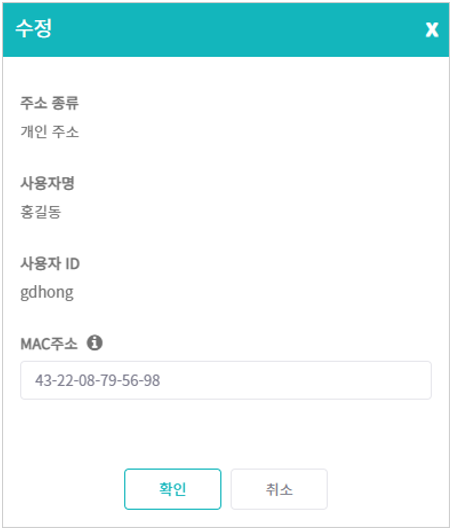
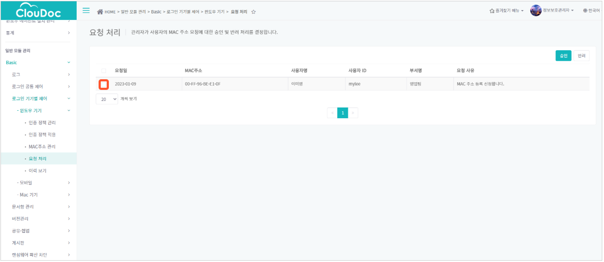
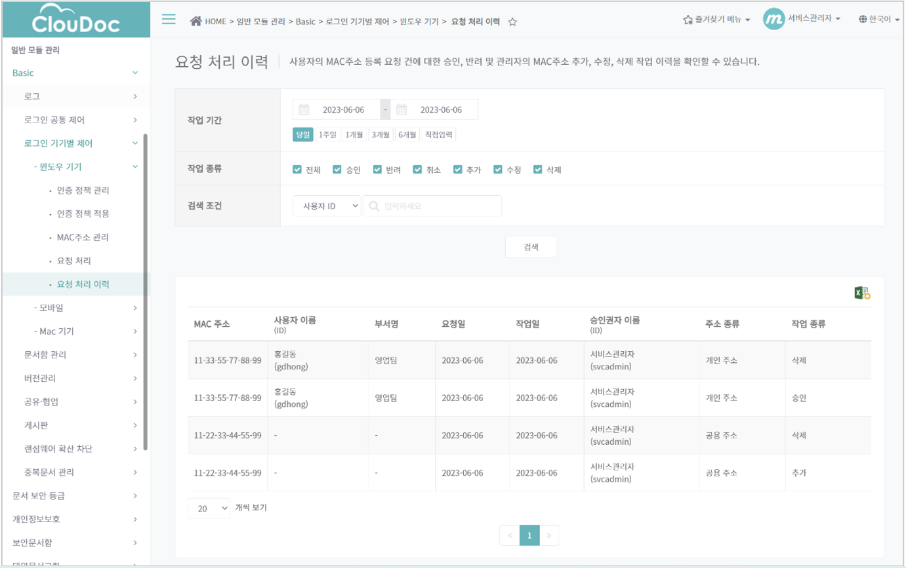

# MAC주소 인증을 통해 윈도우 에이전트 로그인 제어하기

윈도우 에이전트에서 로그인 시 등록된 PC에서만 로그인할 수 있도록 MAC주소 인증을 통해 사용자의 로그인을 제어할 수 있습니다.  관리자는 MAC주소 인증을 위해 사전에 사용자의 MAC주소를 등록해야 하며, MAC주소 인증이 적용될 IP 대역을 설정하여 특정 IP 대역에서 로그인 시에만 MAC주소 인증을 거치도록 설정할 수 있습니다.&#x20;

MAC주소는 통신을 하기 위한 네트워크 장비의 고유한 번호로 하나의 PC 가 복수의 MAC주소를 가질 수 있습니다.

## MAC주소 인증을 위한 IP대역 설정하기

MAC주소 인증을 적용할 IP 대역을 정책으로 설정하여 부서/사용자별로 적용할 수 있습니다.정책 설정 시 다음의 두 가지 방법 중 선택하여 로그인을 허용/차단할 IP대역을 지정할 수 있습니다. 차단할 IP대역에서 로그인 시 MAC주소 인증을 진행하며, 허용할 IP대역에서 로그인 시에는 MAC주소 인증 없이 로그인이 허용됩니다.

1. **차단할 IP대역 등록**:  로그인을 차단할 IP대역을 등록하는 방법으로, 등록하지 않은 IP대역은 기본적으로 **허용할 IP대역**으로 구분됩니다. 이 경우 차단 등록된 IP대역에서 로그인 시에만 MAC주소 인증을 진행하며, 그 외의 경우 MAC주소 인증 없이 로그인이 진행됩니다.
2. **허용할 IP대역 등록**: 로그인을 허용할 IP대역을 등록합니다. 등록하지 않은 IP대역은 기본적으로 **차단할 IP대역**으로 구분되므로, 등록하지 않은 IP대역에서 로그인 시 MAC주소 인증을 거쳐야 합니다.

MAC주소 인증 정책을 설정하는 방법은 다음과 같습니다.

1\.   **일반 모듈 관리 – Basic - 로그인 기기별 제어 – 윈도우 기기 - 인증 정책 관리**를 클릭합니다.

.png>)

2\.   **정책 목록**에서 **추가** 버튼 .png>)을 클릭하여 정책을 추가합니다.

1. \*\*‘정책 추가’\*\*창에서 **정책명**(필수)과 정책에 대한 설명을 입력하고 **확인**을 클릭합니다.

3\.   설정할 정책을 클릭한 후 **IP대역 목록**에서 **등록하는 IP대역 처리 방법** 항목을 선택합니다. **차단**과 **허용** 중에서 한 가지만 택하여 IP대역을 등록할 수 있습니다.

1. **차단(MAC주소 인증)**: 추가하는 모든 IP대역이 차단할 IP대역으로 등록됩니다. 해당 IP대역에서 로그인 시 MAC주소 인증을 거치게 됩니다.
2. **허용(MAC주소 인증 제외)**: 추가하는 모든 IP대역이 허용할 IP대역으로 등록됩니다. 해당 IP대역에서 로그인 시 MAC주소 인증 없이 로그인이 진행됩니다.

.png>)\
.png>)차단할 IP대역이 소수일 경우에는 차단할 IP대역을 등록하고, 차단할 IP대역이 대부분일 경우에는 허용할 IP대역을 등록해야 등록 건수를 줄일 수 있습니다.

4\.    IP대역을 추가하기 위해 우측 상단의 **추가**아이콘 .png>)을 클릭합니다.

5\.    **‘IP대역 추가’** 창에 **시작 IP**(예: 255.0.0.0)와 **끝 IP**(예: 255.255.255.0)를 입력한 후, **확인**을 클릭합니다. **차단하는 IP대역** 또는 **허용하는 IP대역** 목록에 IP대역이 추가된 것을 확인합니다.

6\.   **적용**버튼을 클릭합니다.

.png>)추가한 IP대역이 화면의 **IP대역 목록**에 표시되더라도 **적용** 버튼을 클릭하기 전까지는 서버에 적용되지 않으므로, 반드시 **적용** 버튼을 클릭해야 합니다.

## MAC 주소 인증을 위한 IP대역 변경하기

MAC주소 인증 정책에서 등록된 IP대역의 허용 또는 차단 여부를 일괄적으로 변경하거나, 허용/차단할 IP대역을 추가, 변경, 삭제할 수 있습니다.

1\.   MAC주소 인증 **정책 목록**에서 변경하고자 하는 정책의 이름의 클릭합니다.\
2\.   변경하고자 하는 항목을 아래와 같이 변경합니다.

1. **허용**\*\*/**차단 여부 변경**:\*\* **등록하는** **IP\*\*\*\*대역 처리 방법**의 **허용**\*\*/\*\***차단** 설정을 변경하여 선택할 수 있습니다. 변경 시 기존 IP대역 목록 전체에 변경된 설정이 적용됩니다.
2. **허용/차단할 IP대역 추가**: 우측 상단의 **추가** 아이콘 .png>)을 클릭하여, 기존의 **허용(차단)하는 IP대역 목록**에 IP대역을 추가할 수 있습니다.
3. **허용/차단할 IP대역 변경:등록된 IP대역 우측의연필**아이콘을 클릭하여 IP대역의**시작\*\*\*\*IP**와 **끝\*\*\*\*IP**(예: 255.255.255.0)를 변경할 수 있습니다.
4. **허용/차단할 IP대역 삭제:등록된 IP대역 우측의휴지통**아이콘을 클릭하면 목록에서 IP대역을 삭제할 수 있습니다.

3\.   **적용** 버튼을 클릭합니다. \
​

## 부서 및 사용자에 MAC 주소 인증 정책 적용하기

생성된 MAC주소 인증 정책을 사용자/부서별로 적용하는 방법은 다음과 같습니다.&#x20;

1\.   **일반 모듈 관리 - Basic - 로그인 기기별 제어 - 윈도우 기기 - 인증 정책 적용**을 클릭합니다.\
.png>)

2\.    **조직도**에서 정책을 적용할 부서 또는 사용자를 선택합니다.

3\.    **정책 목록**에서 해당 부서/사용자에 적용할 정책을 선택합니다.

4\.    **적용** 버튼을 클릭하여 변경 사항을 서버에 적용합니다.

.png>)자세한 정책 적용 방법은 \*\*[부서 및 사용자에게 정책을 적용하는 방법](../undefined-2/undefined-3.md)\*\*을 참고하세요.

## MAC주소 관리하기

MAC주소 인증을 위해서는 문서중앙화 서버에 접속하는 PC의 MAC주소를 등록하고 관리해야 합니다. 관리자는 사용자 PC 또는 공용 PC의 MAC주소를 직접 추가, 변경, 삭제할 수 있습니다.

### MAC주소 추가하기

1\.   **일반 모듈 관리 - Basic - 로그인 기기별 제어 - 윈도우 기기 - MAC주소 관리**를 클릭합니다.

.png>)

2\.   MAC주소 목록 우측 상단의 **추가** 버튼을 클릭합니다.

3\.   **'추가'** 창에 다음과 같은 정보를 입력합니다.

1. **주소 종류**: 개인 주소, 공용 주소 중에서 선택합니다.
2. **개인 주소**: 사용자 PC의 MAC주소 등록 시 선택합니다. 로그인하는 PC의 MAC주소가 **개인 주소**로 등록되어 있는 경우, **사용자 정보**와 **MAC주소**가 일치할 경우에만 로그인할 수 있습니다

> > 
>
> 1. **공용 주소**: 공용 PC의 MAC주소 등록 시 선택합니다. 로그인하는 PC의 MAC주소가 **공용 주소**로 등록되어 있는 경우, 로그인하는 사용자에 관계없이 **MAC주소**만 일치하면 로그인할 수 있습니다.
>
> 

1. **사용자**: **개인 주소**로 등록할 경우에만 입력합니다. 사용자의 이름 또는 ID로 검색하여 선택합니다.
2. **MAC주소**: 등록할 기기의 고유번호를 확인하여 입력합니다. 예)E8-A8-8B-F3-48-97

4\.   **확인**을 클릭합니다.등록할 MAC주소를 확인하는 방법은 다음과 같습니다.

1.실행창에서 "cmd"를 입력하고 Enter 키를 누릅니다. (실행창: 키보드의 WIN+R, 윈도우 작업표시줄의 Microsoft Search창 등)

2.명령 프롬프트에서 "getmac /v"을 입력하고 Enter 키를 누릅니다.

3. 화면의 목록 중 문서중앙화 서버 접속 시 사용하는 연결(예: \*\*Wi-Fi,\*\***이더넷**)의 **물리적 주소**(MAC주소)를 사용합니다. (예: E8-A8-8B-F3-48-97)

### MAC주소 등록 정보 조회하기

1\.    **MAC주소 관리** 페이지에서 **주소 종류**를 선택하고 **검색 조건**을 입력합니다.

1. 검색조건으로 **사용자 이름/ID**, **부서명**, **MAC\*\*\*\*주소**를 사용할 수 있습니다. **공용 주소**의 경우에는 사용자 정보가 없으므로 MAC주소만 사용합니다.

2\.    **검색** 버튼을 클릭하면 조건에 해당하는 MAC주소 목록이 표시됩니다.

### MAC주소 변경하기

1\.    MAC주소 목록에서 변경할 MAC주소 우측의 **연필** 아이콘을 클릭합니다.

2\.    **‘수정’** 창에서 등록되어 있는 MAC주소를 변경할 수 있습니다. **주소 종류**나 **사용자 정보**는 변경할 수 없으므로, 변경이 필요한 경우에는 기존의 MAC주소를 목록에서 삭제 후 새로 추가해야 합니다.

 \
3\.   **확인**을 클릭합니다.

### MAC주소 삭제하기

MAC주소 우측의 **휴지통** 아이콘을 클릭하여 해당 MAC주소를 목록에서 삭제할 수 있습니다.

## MAC주소 등록 요청에 대해 승인/반려하는 방법

사용자가 윈도우 에이전트 또는 사용자 웹페이지에서 새로운 기기의 MAC주소 등록을 요청할 경우, 관리자는 사용자의 요청을 승인 또는 반려할 수 있습니다.\
1\.   **일반 모듈 관리 - Basic - 로그인 기기별 제어 - 윈도우 기기 - 요청 처리**를 클릭합니다.

2\.   목록에서 MAC주소 등록을 요청한 사용자 정보 및 요청 사유를 확인합니다.

3\.   처리할 요청 건을 체크하여 선택한 후**승인** 또는 **반려** 버튼을 클릭합니다.

4\.   **확인**을 클릭합니다.

&#x20;

## MAC주소 관리 이력 보기

사용자의 MAC주소 등록 요청 건에 대한 승인, 반려, 취소 이력 및 MAC주소의 추가, 수정, 삭제 이력을 확인할 수 있습니다.

1\.   **일반 모듈 관리 - Basic - 로그인 기기별 제어 - 윈도우 기기 - 요청 처리 이력**을 클릭합니다.

2\.   작업 기간과 작업 종류를 선택하고, 필요시 검색 조건을 입력합니다.

1. **작업 기간**(필수): 관리자 또는 사용자가 작업한 날짜를 지정합니다.
2. **작업 종류**(필수}

> 1) **승인**: 관리자가 사용자의 MAC주소 등록 요청을 승인
> 2) **반려**: 관리자가 사용자의 MAC 주소 등록 요청을 반려
> 3) **추가**: 관리자가 MAC주소를 추가
> 4) **취소**: 사용자가 MAC 주소 등록 요청을 취소
> 5) **삭제**: 관리자 또는 사용자가 등록된 MAC주소를 삭제
> 6) **수정**: 관리자가 등록된 MAC 주소 정보를 변경

1. **검색 조건**:  **사용자이름/ID, 부서명, MAC주소**로 검색할 수 있습니다.

3\.   **검색**을 클릭합니다.

4\.   선택한 조건에 해당하는 MAC주소 관리 이력의 **MAC주소**, **요청일**과 **작업일**, **승인권자 이름(ID)**, **작업 종류**, **주소 종류** 및 **부서명**, **사용자 이름/ID** 등의 사용자 정보(개인 주소일 경우에 한함)를 확인할 수 있습니다.
