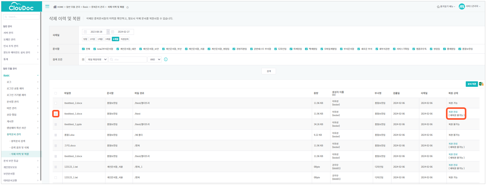

# 중복문서 관리하기

관리자는 중앙문서함에서 문서함별로 중복된 문서를 검색하고, 불필요한 중복문서를 삭제하거나 사용자가 삭제하도록 요청할 수 있습니다. 불필요한 중복문서를 찾아 삭제하면 저장 공간을 확보하고 데이터를 효율적으로 관리할 수 있습니다.중복문서 검색 시 중복문서로 정의할 기준을 선택할 수 있으며, 삭제한 중복문서를 복원할 수도 있습니다.

## 중복문서 관리 프로세스 안내

중복문서 관리 메뉴는 아래와 같이 단계별로 사용합니다.

1. 1단계 :**중복문서\*\*\*\*검색** 메뉴

> 중복문서로 판단할 기준을 설정하여 중복문서를 검색합니다.

1. 2단계 :**검색 결과 및 삭제** 메뉴

> 1단계의 중복문서 검색 결과를 이 메뉴에서 확인할 수 있습니다. 검색 결과 확인 후 중복문서를 삭제합니다.

1. 3단계 :**삭제 이력 및 복원** 메뉴

&#x20;         2단계에서 잘못 삭제한 중복문서가 있다면 이 메뉴에서 복원할 수 있습니다.

## 기준 설정하여 중복문서 검색하기

중복문서를 검색할 문서함/폴더와 중복문서 검색 기준을 선택하여 중복문서 검색을 수행합니다. 이메일 알림을 설정하면 검색 완료 후 지정한 이메일 주소로 알림 메일을 수신할 수 있습니다.\
1\.   **일반 모듈 관리 – Basic – 중복문서 관리 – 중복문서** 검색을 클릭합니다.

.png>)

2\.   \*\*STEP1.\*\***검색 대상 문서함**/**폴더** **선택\*\*\*\*문서함/폴더 선택** 버튼을 클릭하면 ‘폴더 선택’ 창이 팝업됩니다. 검색 대상 문서함을 선택한 후 문서함 전체를 선택하거나 하위 폴더를 선택합니다.\
.png>)**3.  STEP2.중복문서 검색 기준선택\*\*\*\*빠른 검색 또는 고급 검색을 선택하거나 검색 기준을 직접 선택하여 검색할 수 있습니다.**.png>)

1. **빠른 검색 (동일한 파일명, 확장자, 파일 크기)**

동일한 파일명, 확장자, 파일 크기를 기준으로 중복문서를 빠르게 검색합니다.

1. **고급 검색 (동일한 파일 내용, 파일명, 확장자, 파일 크기)**

동일한 파일 내용, 파일명, 확장자, 파일 크기를 기준으로 중복문서를 검색합니다. 상대적으로 느리지만 더 정확한 검색 결과를 제공합니다.

1. **검색 기준 직접 선택**

> 1) **파일명, 파일 확장자명, 파일 크기, 파일 최종 수정일, 파일 내용** 중 검색 기준을 선택합니다. 검색 기준을 1개 선택하거나 검색 대상 파일 개수가 많을 경우 검색 속도가 느려질 수 있어 검색 기준을 2개 이상 선택하는 것을 권장합니다.
> 2) **파일명**으로 검색 시, 파일명의 모든 문자를 비교하거나, 파일명 앞에서부터 특정 문자 수만큼 비교할 수 있습니다. 비교할 문자 수는 파일명 앞에서부터 4 \~ 255 문자 이내로 검색할 수 있습니다.
> 3) **파일 내용**: 이미지를 포함하여 파일 내용이 중복되는 문서를 검색합니다. 검색 작업에 시간이 많이 소요될 수 있습니다.

4\.   **STEP 3.** **이메일 알림 설정**(선택)

1. 입력창에 이메일 주소를 입력하면 검색 완료 후 알림 메일을 수신할 수 있습니다.
2. 문서 개수 및 검색 내용에 따라 시간이 다소 걸릴 수 있습니다. 이메일 주소를 한 개 이상 입력 시, ‘;’로 구분하여 입력합니다.

5\.   **검색**을 클릭하면 다음과 같이 진행을 확인하는 메시지가 팝업됩니다. **확인**을 클릭하여 검색을 진행합니다.

.png>)

6\.   중복문서 검색 중에는 페이지 하단에 **정보 수집 중** 메시지와 함께 수집 완료된 파일 수가 표시됩니다.

.png>)

7\.   검색이 완료되면 페이지 하단에 **검색 완료** 메시지와 함께 **진행 시간, 전체 파일 수** 대비 **중복 파일 수, 시작일시, 종료일시, 검색 문서함, 비교 기준**이 표시됩니다.\
.png>)

.png>)새로운 중복문서 검색 작업이 수행되기 전까지는 최종 검색 결과가 계속 표시됩니다.\
.png>)중복문서 검색이 완료되면 관리자는 다음과 같은 알림 메일을 받습니다.

.png>)

## 중복문서 검색 결과 보기

중복문서 검색 메뉴에서 검색한 결과를 검색 결과 및 삭제 메뉴에서 확인할 수 있습니다.

1\.    **일반 모듈 관리 – Basic – 중복문서 관리 – 검색 결과 및 삭제**를 클릭합니다.\
2\.    **문서함**을 선택합니다.

3\.    필요에 따라 **검색 조건**을 입력합니다..png>)검색 조건 입력 방법은 \*\*[연산자를 이용하여 검색 범위 좁히기](https://github.com/manualcloudoc/mcloudoc-user-manual/blob/main/zoho-export/markdown/%EC%82%AC%EC%9A%A9%EC%9E%90-%EB%A7%A4%EB%89%B4%EC%96%BC/basic/%EC%97%B0%EC%82%B0%EC%9E%90%EB%A5%BC-%EC%9D%B4%EC%9A%A9%ED%95%98%EC%97%AC-%EA%B2%80%EC%83%89-%EB%B2%94%EC%9C%84-%EC%A2%81%ED%9E%88%EA%B8%B0.md)\*\*를 참고하세요.\
4\.    **검색**을 클릭합니다.

.png>)

5\.    **중복문서 그룹 목록**에서 **중복문서 그룹명, 파일 개수, 비교 기준, 검출 날짜**를 확인할 수 있습니다.

6\.    특정 중복문서 그룹명을 클릭하면 **선택한 그룹의 중복문서 목록**에서 해당 그룹의 전체 중복문서 목록을 볼 수 있습니다. **파일명**\*\*,\*\* **파일 경로**\*\*,\*\* **용량**\*\*,\*\* **생성자 이름**\*\*(ID),\*\* **부서명**에 대한 정보를 확인합니다.

.png>)

.png>)중복문서의 내용을 확인하려면 **선택한 그룹의 중복문서 목록**에서 파일명을 클릭합니다. 클릭한 이름의 파일을 다운로드할 수 있습니다.\
다만, 파일 열람 권한이 있는 관리자 계정으로 윈도우 에이전트에 로그인이 된 상태에서만 열람이 가능합니다.

## 중복문서 삭제하기

중복문서를 삭제하는 방법에는 아래와 같이 2가지가 있습니다.

1. 사용자에게 중복문서 삭제요청 메일을 보내 **사용자**가 삭제하도록 하는 방법
2. 관리자가 직접 삭제하는 방법

중복문서 삭제 절차는 다음과 같습니다.\
1\.    **일반 모듈 관리 – Basic – 중복문서 관리 – 검색 결과 및 삭제**를 클릭합니다.

2\.    **문서함**을 선택합니다.

3\.    필요에 따라 검색 조건을 입력합니다. .png>)검색 조건 입력 방법은 \*\*[연산자를 이용하여 검색 범위 좁히기](https://github.com/manualcloudoc/mcloudoc-user-manual/blob/main/zoho-export/markdown/%EC%82%AC%EC%9A%A9%EC%9E%90-%EB%A7%A4%EB%89%B4%EC%96%BC/basic/%EC%97%B0%EC%82%B0%EC%9E%90%EB%A5%BC-%EC%9D%B4%EC%9A%A9%ED%95%98%EC%97%AC-%EA%B2%80%EC%83%89-%EB%B2%94%EC%9C%84-%EC%A2%81%ED%9E%88%EA%B8%B0.md)\*\*를 참고하세요.4.    **검색**을 클릭합니다.

5\.    삭제할 중복문서 그룹 또는 개별 중복문서의 체크박스를 선택합니다. .png>)삭제 후 복원한 파일은 검색 결과에서 보이지 않습니다. 복원한 파일을 삭제하려면 파일 탐색기에서 직접 삭제하여야 합니다.6.    **사용자 삭제요청** 또는 **직접 삭제** 버튼을 클릭합니다.

1. **사용자 삭제요청:** ‘사용자 삭제요청’창에서 삭제 요청할 사용자 유형을 선택 후 **삭제 요청** 버튼을 클릭합니다.
2. 선택 파일 사용자: 선택한 파일을 생성한 사용자에게 삭제요청 메일을 보냅니다. 이때, 선택한 파일 이외에도 해당 사용자와 관련해서 검색된 모든 파일을 함께 삭제 요청합니다.
3. 전체 파일 사용자: 검색된 모든 중복문서의 사용자에게 삭제요청 메일을 보냅니다.
4. **직접 삭제:** ‘직접 삭제’창에서 직접 삭제할 파일 유형을 선택 후 **직접 삭제** 버튼을 클릭합니다.
5. 선택 파일: 관리자가선택한 파일만 삭제합니다.
6. 원본을 제외한 전체 중복 파일: 그룹별 첫 행의 문서를 원본 문서로 간주하여 제외하고 나머지 중복문서만 모두 삭제합니다.
7. 전체 파일: 검색된 모든 중복문서를 삭제합니다. 파일 개수가 많은 경우 삭제 작업에 시간이 다소 소요될 수 있습니다.

.png>)관리자가 삭제 요청 메일을 발송하면 사용자는 다음과 같은 이메일을 받습니다. 이메일은 중\
복문서의 개수, 용량 등에 대한 정보와 관련 페이지로 바로 이동할 수 있는 링크를 포함하고 있습니다.

.png>)

## 삭제한 중복문서 복원하기

중복문서 삭제 이력을 확인 후 삭제된 중복문서를 복원할 수 있습니다. 복원은 파일당 한 번만 가능합니다. 또한, 검색 결과 및 삭제 메뉴에서 삭제한 파일만 삭제 이력 및 복원 메뉴에서 복원할 수 있습니다. 파일 탐색기에서 삭제한 경우 이 메뉴에서 복원할 수 없습니다.

1\.    **일반 모듈 관리 – Basic – 중복문서 관리 – 삭제 이력 및 복원**을 클릭합니다.

2\.    **삭제일**과 **문서함**을 선택합니다.

3\.    필요에 따라 검색 조건을 입력합니다. 검색 조건 입력 방법은 [**연산자를 이용하여 검색 범위 좁히기**](https://github.com/manualcloudoc/mcloudoc-user-manual/blob/main/zoho-export/markdown/%EC%82%AC%EC%9A%A9%EC%9E%90-%EB%A7%A4%EB%89%B4%EC%96%BC/basic/%EC%97%B0%EC%82%B0%EC%9E%90%EB%A5%BC-%EC%9D%B4%EC%9A%A9%ED%95%98%EC%97%AC-%EA%B2%80%EC%83%89-%EB%B2%94%EC%9C%84-%EC%A2%81%ED%9E%88%EA%B8%B0.md)를 참고하세요.4.    **검색**을 클릭합니다.

5\.   목록에서 복원할 중복문서의 체크박스를 선택합니다. 이미 복원된 파일이거나 삭제 후 일정 기간이 지나 보관 파일이 완전히 삭제된 경우 복원할 수 없어 체크박스를 선택할 수 없습니다.아래 2가지의 경우 삭제한 파일은 임시 보관 경로 (예:/plusdrive/home/0000/empty\_recycle\_bin)로 이동되고 일정 기간이 지난 후에는 완전히 삭제되어 복원할 수 없습니다.

1. 관리자 또는 사용자가 중복문서 관리 메뉴에서 파일을 삭제한 경우
2. 윈도우 탐색기에서 파일을 삭제한 후 휴지통에서 휴지통 비우기를 한 경우

임시 보관 파일의 삭제 주기는 기본값이 180일이며 아래 경로에서 삭제 주기를 변경할 수 있습니다.

1. 설정홈
   * 고급 설정 - 파일 보관일 설정 - 휴지통 비운 파일 임시 보관기간

6\.    목록 상단 우측의 **문서 복원** 버튼을 클릭합니다.

7\.    **‘파일 복원’** 창에서 파일 유형을 선택한 후 **확인** 버튼을 클릭합니다.

1. **전체 파일**: 복원할 수 없는 파일을 제외하고 목록의 전체 파일을 복원합니다. 파일 개수가 많은 경우 복원 작업에 시간이 다소 소요될 수 있습니다.
2. **선택 파일**: 목록에서 선택한 파일만 복원합니다.
