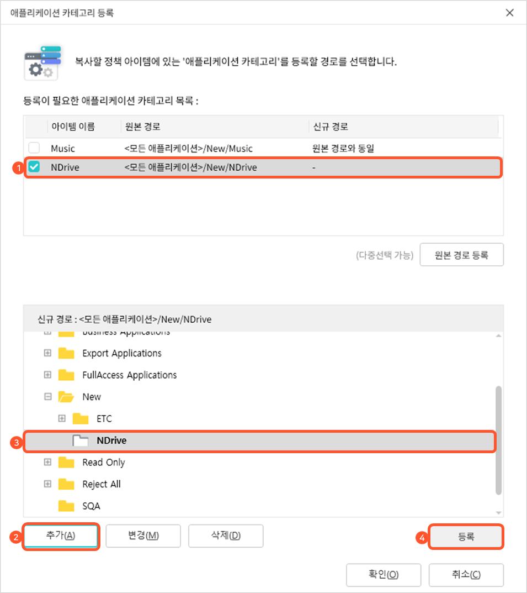

# DiskLock 콘솔에서 로컬저장금지 정책 생성 및 편집하기

### <mark style="color:$primary;">DiskLock 콘솔의 로컬저장금지 정책 관리 화면 살펴보기</mark>

DiskLock 콘솔 화면의 메뉴에서 **로컬저장금지 정책 – 정책 관리** 메뉴를 선택하면 다음과 같이 로컬저장금지 정책을 설정하는 화면이 표시됩니다. 설정 화면에서 정책을 관리할 때 사용되는 부분은 **정책 목록**과 왼쪽 상단에 있는 **도구모음**입니다. 

<figure><figcaption></figcaption></figure>

#### 로컬저장금지 정책 목록

현재 정의된 로컬저장금지 정책들을 보여주는 부분입니다. 로컬저장금지 정책은 문자 코드 순서로 정렬되어 표시됩니다. 정책 이름을 클릭하면 해당 정책에 포함되어 있는 정책 아이템들이 화면의 오른쪽 부분에 표시됩니다. 로컬저장금지 정책 중에서 이름 왼쪽에 PC 모양으로 된 아이콘.png>)이 있는 정책은 현재 사용자 PC에 적용된 정책입니다.

#### 로컬저장금지 정책 도구모음

로컬저장금지 정책 목록의 상단에 있는 도구모음은 로컬저장금지 정책을 관리하는 데 사용되는 메뉴들이 아이콘 형태로 제공됩니다. 도구모음의 아이콘은 상황에 따라 사용 가능한 아이콘만 활성화됩니다. 각 아이콘의 기능은 다음과 같습니다.

<table><thead><tr><th width="138.18182373046875">아이콘</th><th>기능</th></tr></thead><tbody><tr><td><strong>새 정책</strong></td><td>새로운 로컬저장금지 정책을 생성합니다.</td></tr><tr><td><strong>삭제</strong></td><td>선택한 로컬저장금지 정책을 삭제합니다.</td></tr><tr><td><strong>이름변경</strong></td><td>선택한 로컬저장금지 정책의 이름을 변경합니다.</td></tr><tr><td><strong>사본생성</strong></td><td>선택한 로컬저장금지 정책의 복사본을 생성합니다. 새로 생성하려는 로컬저장금지 정책이 기존 로컬저장금지 정책과 유사할 경우 복사본을 사용하면 정책 아이템을 새로 정의하는 등의 번거로운 작업 없이 간편하게 새로운 정책을 만들 수 있습니다.</td></tr></tbody></table>

####  컨텍스트 메뉴

로컬저장금지 정책 목록에서 마우스를 우클릭하면 현재 사용할 수 있는 메뉴들을 보여주는 데 이를 **컨텍스트 메뉴**라고 합니다.

컨텍스트 메뉴 중 삭제, 이름변경, 사본생성, 새정책은 도구모음에 있는 메뉴와 기능과 동일합니다. **내보내기, 가져오기** 메뉴의 기능은 다음과 같습니다.​

<table><thead><tr><th width="131.8182373046875">메뉴</th><th>기능</th></tr></thead><tbody><tr><td><strong>내보내기</strong></td><td>선택한 로컬저장금지 정책을 지정한 폴더에 파일로 저장합니다. 파일은 DiskLock Policy(*.dpo) 형태로 저장되고, <strong>가져오기</strong> 메뉴를 사용하여 DiskLock 콘솔로 불러올 수 있습니다.</td></tr><tr><td><strong>가져오기</strong></td><td><strong>내보내기</strong> 기능을 통해 저장했던 정책 파일(*.dpo)을 가져와 새 정책으로 추가합니다.</td></tr></tbody></table>

### <mark style="color:$primary;">로컬저장금지 정책 생성하기</mark>

새로운 로컬저장금지 정책을 생성하는 방법은 다음과 같습니다.

1\.   정책 관리 화면의 상단 도구모음에서 **새 정책**을 클릭하거나 화면 왼쪽의 정책 목록에서 마우스를 우클릭하여 나오는 컨텍스트 메뉴에서 **새 정책**을 클릭합니다.

2\.   정책 목록의 가장 아래쪽에 다음과 같이 **새 정책**이라는 이름의 정책이 만들어집니다. 이미 같은 이름의 정책이 있으면 이름 뒤에 숫자가 1부터 자동으로 추가됩니다.

3\.   정책의 이름을 입력하고 Enter키를 누릅니다.

4\.   새 정책을 생성한 후에는 \*\*[로](https://support.mcloudoc.com/portal/ko/kb/articles/disklock-%EC%BD%98%EC%86%94%EC%97%90%EC%84%9C-%EB%A1%9C%EC%BB%AC%EC%A0%80%EC%9E%A5%EA%B8%88%EC%A7%80-%EC%A0%95%EC%B1%85-%EC%95%84%EC%9D%B4%ED%85%9C-%EC%84%A4%EC%A0%95%ED%95%98%EA%B8%B0)[컬저장금지 정책 아이템 설정하기](disklock-2.md)\*\*를 참고하여 정책에 포함시킬 정책 아이템을 새로 만들거나 기존 정책에 사용 중인 정책 아이템을 복사하여 정책을 구성합니다.

### <mark style="color:$primary;">로컬저장금지 정책 삭제하기</mark>

불필요한 로컬저장금지 정책을 삭제하는 방법은 다음과 같습니다.

1\.   로컬저장금지 정책 관리 화면의 왼쪽에 있는 정책 목록에서 삭제할 정책을 클릭한 후 정책 목록 상단의 도구모음에서 **삭제**를 클릭하거나 정책을 마우스 우클릭한 후 컨텍스트 메뉴에서 **삭제**를 클릭합니다.&#x20;

<figure><figcaption></figcaption></figure>

2\.   정책의 삭제 여부를 확인하는 팝업 창이 나타나면**예**를 클릭합니다.

### <mark style="color:$primary;">로컬저장금지 정책 이름 변경하기</mark>

로컬저장금지 정책의 이름을 변경하는 방법은 다음과 같습니다.

1\.    로컬저장금지 정책 관리 화면의 왼쪽에 있는 정책 목록에서 이름을 바꿀 정책을 클릭한 후 정책 목록 상단의 도구모음에서 **이름변경**을 클릭하거나 정책을 마우스 우클릭한 후 컨텍스트 메뉴에서 **이름변경**을 클릭합니다.

<figure><figcaption></figcaption></figure>

\
&#x20; 2\.   선택한 정책의 이름이 수정 가능한 상태로 바뀝니다. 새로운 정책 이름을 입력한 후 Enter 키를 누릅니다.

### <mark style="color:$primary;">로컬저장금지 정책 사본 생성하기</mark>

기존 로컬저장금지 정책의 복사본을 만드는 방법은 다음과 같습니다.

1\.   로컬저장금지 정책 관리 화면의 왼쪽에 있는 정책 목록에서 복사본을 생성할 정책을 클릭한 후 도구모음에서 **사본생성**을 클릭하거나 정책을 마우스 우클릭한 후 컨텍스트 메뉴에서 **사본생성**을 클릭합니다.&#x20;

<figure><figcaption></figcaption></figure>

\
2\.   선택한 정책의 복사 여부를 묻는 팝업창이 나타나면 **예**를 클릭합니다.

3\.   정책 목록 맨 아래쪽에 다음과 같이 선택한 정책 이름 뒤에 **복사본**이 붙여진 새로운 정책이 만들어집니다.\
&#x20;.png>)

4\.   정책을 복사한 후에는 복사된 정책의 이름을 변경하거나 [**로컬저장금지 정책 아이템 설정하기**](disklock-2.md)를 참고하여 기존 정책에 포함된 정책 아이템을 수정 혹은 삭제하거나 새로운 정책 아이템을 추가하는 등의 정책 설정 작업을 수행합니다.

### <mark style="color:$primary;">로컬저장금지 정책 내보내기</mark>

로컬저장금지 정책을 파일로 저장하는 방법은 다음과 같습니다.

1\.   로컬저장금지 정책 관리 화면의 왼쪽에 있는 정책 목록에서 파일로 저장할 정책을 마우스 우클릭한 후 컨텍스트 메뉴에서 **내보내기**를 클릭합니다.

2\.   **다른 이름으로 저장** 팝업 창이 나타나면 정책을 저장할 경로와 파일 이름을 입력한 후 **저장**을 클릭합니다. 기본 파일 이름은 정책의 이름으로 설정됩니다.

.png>)

### <mark style="color:$primary;">로컬저장금지 정책 가져오기</mark>

**정책 내보내기**를 통해 저장했던 로컬저장금지 정책 파일을 가져와 새 정책으로 추가하는 방법은 다음과 같습니다.

1\.   로컬저장금지 정책 관리 화면의 왼쪽에 있는 정책 목록을 마우스 우클릭한 후 컨텍스트 메뉴가 나타나면 **가져오기**를 클릭합니다.

2\.   다음과 같은 **열기** 창이 나타납니다. 가져올 정책 파일(\*.dpo)이 저장된 폴더에서 파일을 선택한 후 **열기**를 클릭합니다.&#x20;

<figure><figcaption></figcaption></figure>

\
3\.   가져온 정책이 로컬저장금지 정책 목록에 추가됩니다. 만약 정책 목록에 가져온 정책과 동일한 이름의 정책이 이미 존재하는 경우에는 정책 이름 뒤에 숫자가 자동으로 추가됩니다.

4\.   필요한 경우, 가져온 정책의 이름을 변경하거나 [**로컬저장금지 정책 아이템 설정하기**](disklock-2.md)를 참고하여 정책에 포함된 정책 아이템을 수정 혹은 삭제하거나 새로운 정책 아이템을 추가하는 등의 정책 설정 작업을 수행합니다.


저장해둔 정책 파일에 삭제된 애플리케이션 카테고리를 사용하는 정책 아이템이 포함되어 있으면 파일을 가져올 때 이를 알려주는 **애플리케이션 카테고리 등록** 팝업 창이 나타납니다. 이런 경우에는 이어지는 **애플리케이션 카테고리 재지정하기**의 내용을 참고하여 해당 정책 아이템이 적용될 애플리케이션 카테고리를 다시 지정하도록 합니다.


#### **애플리케이션 카테고리 재지정하기**

**정책 내보내기**를 통해 파일로 저장해둔 로컬저장금지 정책에 삭제된 애플리케이션 카테고리에 적용되는 정책 아이템이 포함되었으면 **정책 가져오기** 기능을 실행했을 때 해당 정책 아이템을 보여주는 **애플리케이션 카테고리 등록** 창이 나타납니다. 이런 경우에는 다음 설명을 참고하여 해당 정책 아이템의 애플리케이션 카테고리를 다시 지정합니다.\
&#x20;\
1\.   **애플리케이션 카테고리 등록** 창의 **등록이 필요한 애플리케이션 카테고리 목록**에는 삭제된 애플리케이션 카테고리를 사용하는 정책 아이템과 해당 카테고리의 경로(현재 존재하지 않는 이전의 경로)가 표시됩니다. 아래의 **경로 설정**에는 현재 설정된 애플리케이션 카테고리가 트리 형태로 보여집니다.

<figure><figcaption></figcaption></figure>

2\.   **등록이 필요한 애플리케이션 카테고리 목록**에서 카테고리를 다시 지정할 정책 아이템을 체크해서 선택합니다. 정책 아이템을 선택한 후에는  정책 아이템에 설정되어 있는 기존 애플리케이션 카테고리를 새 애플리케이션 카테고리로 추가할 지(**원본 경로 등록**), 정책 아이템이 적용될 애플리케이션 카테고리를 다른 애플리케이션 카테고리로 새로 지정할지(**신규 경로 등록**)에 따라 해당 과정을 진행합니다.

\
&#x20; (**원본 경로 등록**) 원본 경로를 등록하는 경우에는 동시에 여러 개의 정책 아이템을 선택할 수 있습니다. 정책 아이템을 선택한 후 추가한 목록 아래에 있는 **원본 경로 등록**을 클릭합니다.&#x20;

<figure><figcaption></figcaption></figure>

\
애플리케이션 카테고리 경로를 기존과 동일하게 등록할 것 인지 확인하는 팝업 창이 나타나면 **확인**을 클릭합니다.\
&#x20;\
 (**신규 경로 등록**) 애플리케이션 카테고리 트리에서 새로 지정해줄 애플리케이션 카테고리를 선택합니다. 카테고리 왼쪽의 +를 클릭하거나 더블클릭하면 하위 애플리케이션 카테고리를 볼 수 있습니다. 원하는 카테고리가 없는 경우에는 트리 아래에 있는 **추가**를 클릭하여 카테고리를 새로 추가하거나 **수정**을 클릭하여 카테고리의 이름을 변경할 수 있습니다. 애플리케이션 카테고리를 선택한 후에는 **등록**을 클릭합니다.

<figure><figcaption></figcaption></figure>

새로 지정한 애플리케이션 카테고리를 새로운 경로로 설정할지 묻는 팝업 창이 나타나면 **확인**을 클릭합니다.&#x20;


화면 하단에 있는 **추가**나 **변경**을 클릭하여 새로운 애플리케이션 카테고리를 추가하거나 변경한 후 이 카테고리를 신규 경로로 지정하지 않으면 **애플리케이션 카테고리 등록** 창이 닫힐 때 애플리케이션 카테고리 트리에서 삭제됩니다. **삭제**는 **애플리케이션 카테고리 등록** 창에서 생성한 카테고리를 삭제할 때만 사용할 수 있고 기존에 생성되어 있는 카테고리는 삭제할 수 없습니다.


3\.   2번 과정을 반복하여 **등록이 필요한 애플리케이션 카테고리 목록**에 있는 모든 애플리케이션 카테고리를 다시 지정한 후 **확인**을 클릭합니다.

4\.   화면 우측 상단 도구모음에서 **적용**을 클릭하여 변경된 애플리케이션 카테고리 정보를 서버에 적용합니다. 서버에 정상적으로 적용되면 정책 아이템 왼쪽에 표시되었던 붉은색 <mark style="color:red;">**N**</mark>이 사라집니다.

***

아래의영상을 통해 DiskLock 콘솔에서 로컬저장금지 정책을 생성하고 편집하는 상세한 과정을 볼 수 있습니다.


