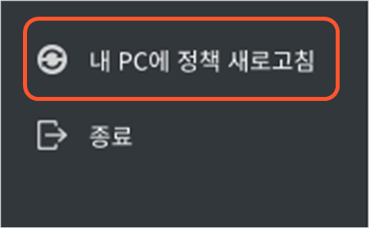
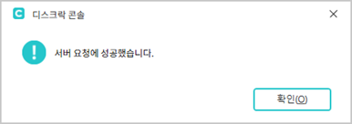
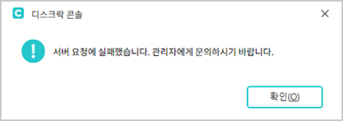
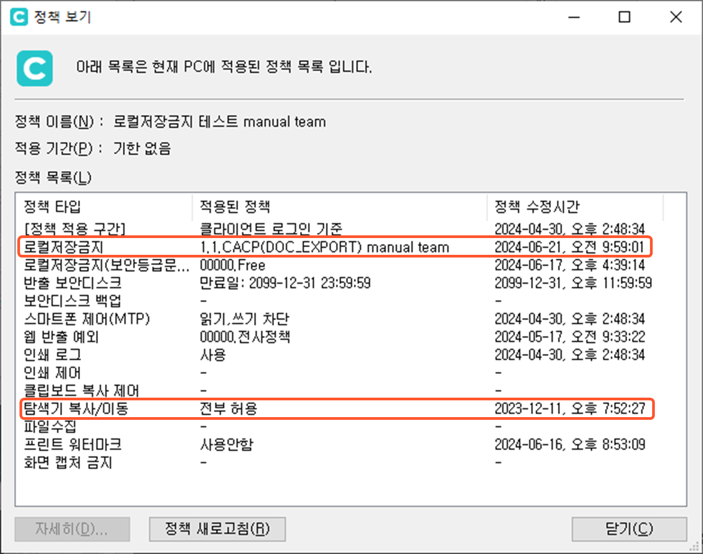

# DiskLock 콘솔 사용하기

DiskLock은 문서 중앙화 솔루션에서 제공하는 보안 기능입니다. 기업의 정보가 유출될 수 있는 여러 가능성들을 모두 사전에 차단할 수 있도록 다양한 기능을 제공합니다. 애플리케이션의 종류별로 각 디스크의 파일 입출력을 제한하는 **로컬저장금지** 기능, 윈도우 탐색기를 통한 정보 유출을 막아주는 **탐색기 복사/이동 제한** 기능 등이 대표적인 DiskLock의 보안 기능입니다. 그리고, 이러한 보안 기능들로 인해 업무 상 제약들이 발생하지 않도록 해주는 **보안디스크** 기능과 허가된 문서를 반출할 수 있도록 하는 **반출 기능** 등도 함께 제공됩니다.

**DiskLock콘솔**에서는 DiskLock 기능을 사용하는 데 필요한 **로컬저장금지 정책, 탐색기 복사/이동 정책** 및 **보안디스크 정책**을 설정할 수 있습니다. 또한, 로컬저장금지 정책 등 DiskLock과 DiskLock Plus 일부 정책에서 작업의 허용/차단을 적용하는 단위가 되는 **애플리케이션 카테고리**를 생성하거나 분류하는 작업도 DiskLock 콘솔에서 수행합니다. 다음은 DiskLock 콘솔에서 수행할 수 있는 작업들을 기능 별로 정리한 것입니다.

* **애플리케이션 카테고리 관리**

> - 새로운 애플리케이션 카테고리를 생성하거나 삭제할 수 있습니다.
> - 애플리케이션들을 특정 카테고리로 분류하거나 미분류 카테고리의 애플리케이션을 자동으로 분류하는 자동분류를 설정할 수 있습니다.

* **로컬저장금지 정책 관리 및 적용**

> - 새로운 로컬저장금지 정책을 생성하거나 삭제할 수 있습니다.
> - 정책에 포함되는 정책 아이템들을 추가하거나 변경, 삭제하고 정책 아이템들의 우선 순위를 조정할 수 있습니다.
> - 부서나 사용자에게 적용할 로컬저장금지 정책을 선택합니다.

* **로컬저장금지 정책 관련 로그 조회**

> - 로컬저장금지 정책의 정책 아이템에 의해 생성된 로그를 조회하고 파일로 저장할 수 있습니다.

* **탐색기 복사/이동 정책 관리 및 적용**

> - 새로운 탐색기 복사/이동 정책을 생성하거나 기존 정책의 설정을 변경, 삭제할 수 있습니다.
> - 부서나 사용자에게 적용할 탐색기 복사/이동 정책을 선택합니다.

* **보안디스크 정책 관리 및 적용**

> 부서나 사용자별로 사용할 수 있는 보안디스크의 종류와 보안디스크의 용량을 설정할 수 있습니다.


통합 정책을 사용하지 않는 경우에만 사용자와 부서에 적용할 로컬저장금지 정책이나 탐색기 복사/이동 정책을 선택할 수 있습니다.



DiskLock의 기능에 대한 상세한 설명은 **사용자 매뉴얼** – [**DiskLock 기능 소개**](https://app.gitbook.com/s/vQ0BiQsGY4PT08D7Nfay/disklock)를 참고합니다.


&#x20;다음 동영상에서 DiskLock 콘솔 리뉴얼 버전의 개선 사항을 확인할 수 있습니다.



#### <mark style="color:$primary;">DiskLock 콘솔 실행하기</mark>

DiskLock 콘솔을 실행하는 방법은 다음과 같습니다.&#x20;

1. 웹 페이지에 로그인한 후 화면 왼쪽 메뉴에서 **PC 보안 모듈 관리– DiskLock – 로컬저장금지– 콘솔 실행** 메뉴를 클릭합니다.

.png>)

2. **콘솔 실행** 화면이 나타나면 페이지 하단의 **DiskLock 콘솔 실행** 버튼을 클릭합니다.

<figure><figcaption></figcaption></figure>

3. 다음과 같은 '디스크락 콘솔' 창이 나타납니다.

.png>)

DiskLock 콘솔 화면은 보안 기능을 하나의 정책으로 통합하는 **통합 정책**의 사용 여부에 따라 제공되는 메뉴가 달라집니다. 통합 정책을 사용하는 경우에는 위와 같은 화면이 나타나고 통합 정책을 사용하지 않는 경우에는 각 보안 정책을 개별적으로 적용해야 하기 때문에 다음과 같이 **로컬저장금지 정책**과 **탐색기 복사/이동 정책에 정책 적용** 메뉴가 추가로 지원되는 화면이 나타납니다.&#x20;

<figure><figcaption></figcaption></figure>


통합 정책은 웹에서 **PC 보안 모듈 관리 - 모듈 통합정책 적용 – 정책 적용**메뉴를 사용하여 설정할 수 있습니다. 이 메뉴를 사용하여 통합 정책을 생성하고 적용하는 방법은 [**모듈 통합정책 생성 및 적용하기**](../../undefined/undefined.md)를 참고합니다.&#x20;


#### <mark style="color:$primary;">DiskLock 콘솔 종료하기</mark>

DiskLock 콘솔을 통한 보안 정책들의 설정 작업이 끝나면 다음과 같은 방법으로 DiskLock 콘솔을 종료합니다. &#x20;

1. DiskLock 콘솔 화면의 메뉴 트리에서 맨 아래에 있는**종료** 메뉴를 클릭합니다.&#x20;

2. DiskLock 콘솔의 종료 여부를 확인하는 **종료 확인** 팝업 창이 나타납니다. **예**를 클릭합니다.

#### <mark style="color:$primary;">DiskLock 콘솔 화면 살펴보기</mark>

DiskLock 콘솔 화면은 **메뉴 카테고리**, **도구모음**,**작업 영역**으로 구성되어 있습니다. 화면에는 보이지 않지만 작업 영역에서 마우스를 우클릭했을 때 상황에 맞는 메뉴들이 나타나는 **컨텍스트 메뉴**도 제공됩니다. DiskLock 콘솔 화면 중 메뉴 카테고리를 제외한 나머지 부분은 메뉴 카테고리에서 선택한 메뉴에 따라 변경됩니다.

.png>)


통합 정책을 사용하지 않는 경우에는 **로컬저장금지 정책**과 **탐색기 복사/이동 정책**에 **정책 적용** 메뉴가 추가로 제공됩니다.


 **메뉴 카테고리**

> 메뉴 카테고리에는 DiskLock 콘솔에서 제공하는 보안 정책들을 설정하는 데 사용되는 메뉴 항목들이 표시됩니다. 다음은 각 메뉴 카테고리에서 수행할 수 있는 작업을 정리한 표입니다. 각 메뉴 카테고리를 클릭하면 해당 기능을 설정할 수 있는 아티클로 이동합니다.

<table><thead><tr><th width="208">메뉴 카테고리</th><th>기능</th></tr></thead><tbody><tr><td><a href="mgmtcategory.md"><strong>애플리케이션 관리</strong></a></td><td>새로운 애플리케이션 카테고리를 생성하거나 기존 애플리케이션 카테고리의 이름을 변경하고 삭제할 수 있습니다. 애플리케이션을 특정 카테고리로 직접 분류하거나 미분류된 애플리케이션이 자동 분류되도록 설정할 수 있습니다.</td></tr><tr><td><a href="disklock.md"><strong>로컬저장금지 정책</strong></a></td><td>새로운 로컬저장금지 정책을 생성하거나 기존 정책의 설정을 변경하고 삭제할 수 있습니다. 통합 정책을 사용하지 않는 경우에는 사용자나 부서에 적용할 로컬저장금지 정책을 지정할 수 있습니다. 또한, 로컬저장금지 정책에 의해 생성된 로그를 조회할 수 있습니다.</td></tr><tr><td><a href="disklock-6.md"><strong>탐색기 복사/이동 정책</strong></a></td><td>새로운 탐색기 복사/이동 정책을 생성하거나 기존의 정책을 수정 및 삭제할 수 있습니다. 통합 정책을 사용하지 않는 경우에는 부서나 사용자별로 탐색기 복사/이동 정책을 적용할 수 있습니다.</td></tr><tr><td><a href="disklock-5.md"><strong>보안디스크 정책</strong></a></td><td>부서나 사용자별로 보안디스크들의 사용 여부와 할당할 디스크 용량을 지정할 수 있습니다.</td></tr><tr><td><a href="./"><strong>내 PC에 정책 새로 고침</strong></a></td><td>DiskLock 콘솔에서 사용자 PC에 적용된 정책을 변경한 경우, 변경 사항을 바로 사용자 PC에 적용합니다.</td></tr><tr><td><strong>종료</strong></td><td>DiskLock 콘솔을 종료합니다.</td></tr></tbody></table>

 **도구 모음**

> 도구 모음에는 메뉴 카테고리에서 선택한 메뉴를 사용할 때 필요한 세부 기능들이 아이콘 형태로 제공됩니다. 도구 모음의 아이콘은 상황에 따라 사용 가능한 아이콘만 활성화됩니다.

 **작업 영역**

> 작업 영역에는 메뉴 카테고리에서 선택한 메뉴와 관련된 현재 설정 정보가 표시되는 부분입니다. 애플리케이션 카테고리 분류 메뉴를 선택하면 현재 설정된 애플리케이션 카테고리 목록이 표시되고 로컬저장 금지정책 관리 메뉴나 탐색기 복사/이동 정책 관리 메뉴를 선택하면 현재 설정되어 있는 해당 정책 목록이 표시됩니다.

 **컨텍스트 메뉴**

> 작업 영역에서 마우스를 우클릭하면 현재 사용할 수 있는 세부 메뉴들을 보여주는 컨텍스트 메뉴가 나타납니다. 컨텍스트 메뉴는 대부분의 경우 도구 모음에서 활성화된 아이콘과 같습니다. 다음은 **애플리케이션 관리 - 카테고리 분류** 메뉴 화면에서 마우스를 우클릭했을 때 나타나는 컨텍스트 메뉴입니다.

#### <mark style="color:$primary;">내 PC에 정책 즉시 반영하기</mark>

DiskLock 콘솔에서 변경한 정책은 서버에 적용하고 일정 시간이 지난 후에 사용자 PC에 적용됩니다. 하지만, DiskLock 콘솔을 실행 중인 사용자 PC에 적용된 정책을 변경한 경우에는 다음과 같은 방법으로 변경된 정책을 사용자 PC에 바로 적용해볼 수 있습니다.

1. DiskLock 콘솔의 메뉴 카테고리에서 하단에 있는 **내PC에 정책 새로 고침**을 클릭합니다.

<figure><figcaption></figcaption></figure>

2. 성공적으로 정책이 적용되면 다음과 같은 팝업 창이 나타납니다. **확인**을 클릭합니다.


서버 연결에 문제가 발생하거나 에이전트에 로그인하지 않은 경우에는 다음과 같은 팝업창이 나타납니다.



3. 에이전트의 트레이 메뉴에서 **정책 보기…** 메뉴를 선택하면 사용자 PC에 현재 적용된 정책들의 정보를 보여주는 다음과 같은 **정책 보기** 창이 나타납니다. 로컬저장금지와 탐색기 복사/이동 정책이 수정된 시간을 확인하면 DiskLock 콘솔에서 변경된 정책이 사용자 PC에 적용되었는지 확인할 수 있습니다.

