# DiskLock 콘솔에서 로컬저장금지 정책 아이템 설정하기

### ​<mark style="color:$primary;">DiskLock 콘솔의 로컬저장금지 정책 아이템 설정 화면 살펴보기</mark> 

DiskLock 콘솔의 로컬저장금지 정책 관리 화면에서 정책 목록에 있는 정책을 클릭하면 해당 정책에 포함될 정책 아이템을 설정할 수 있습니다. 다음은 정책 목록에서 **Central Access Control Policy(DOC\_EXPORT)** 로컬저장금지 정책을 클릭했을 때 보여지는 화면입니다. 화면에서 정책 아이템을 설정할 때 사용되는 부분은 **정책 아이템 목록**과 오른쪽 상단에 있는 **도구모음**입니다.

.png>)

#### **정책 아이템 목록**

로컬저장금지 정책 목록에서 클릭한 정책에 속한 정책 아이템 목록과 각 정책 아이템에 대한 정보를 보여주는 부분입니다. 화면에는 각 정책 아이템에 대한 다음과 같은 정보를 보여줍니다.

.png>)

<table data-search="false"><thead><tr><th width="136">항목</th><th>정보</th></tr></thead><tbody><tr><td><strong>No.</strong></td><td>정책 아이템이 정책에 추가된 순서. 이 값이 큰 정책일수록 높은 우선순위로 적용됩니다.</td></tr><tr><td><strong>아이템 이름</strong></td><td>정책 아이템의 이름</td></tr><tr><td><strong>상태</strong></td><td>정책 아이템의 활성화 여부. 활성화 상태인 정책 아이템만 정책에 적용됩니다.</td></tr><tr><td><strong>애플리케이션</strong></td><td>정책 아이템이 적용되는 애플리케이션 카테고리</td></tr><tr><td><strong>작업</strong></td><td>
정책 아이템 적용되는 애플리케이션 카테고리에 속한 애플리케이션에게 허용되거나 차단된 권한. 다음과 같은 4가지 권한이 있습니다.

 - :읽기 권한,   :쓰기 권한,   : 목록 보기 권한,  :삭제 권한

선택되지 않은 권한은 회색으로 표시됩니다.
</td></tr><tr><td><strong>액션</strong></td><td><strong>작업</strong> 항목의 권한들이 허용되었는지 차단되었는지 여부</td></tr><tr><td><strong>디스크 종류</strong></td><td>
정책 아이템이 적용되는 디스크의 종류. 다음과 같은 8종류가 있습니다.

-   :온라인 보안디스크,  :오프라인 보안디스크,   :반출 보안디스크,  :중앙 문서함 

-  :고정 디스크,  : CD-ROM,   :네트워크 디스크,  :이동식 디스크

 검정색 글씨의 디스크는 비안전구역의 디스크이고 나머지 디스크들은 안전구역에 해당됩니다. 정책 아이템이 적용되지 않는 디스크는 회색으로 표시됩니다. 

보안디스크에 대한 상세한 설명은 <a href="https://github.com/manualcloudoc/mcloudoc-user-manual/blob/main/zoho-export/markdown/%EC%82%AC%EC%9A%A9%EC%9E%90-%EB%A7%A4%EB%89%B4%EC%96%BC/disklock/%EB%B3%B4%EC%95%88%EB%94%94%EC%8A%A4%ED%81%AC-%EC%86%8C%EA%B0%9C.md"><strong>보안디스크 소개</strong></a> 의 내용을 참고합니다.
</td></tr><tr><td><strong>경로</strong></td><td>정책 아이템이 적용되는 폴더의 경로. 정책 아이템을 설정할 때 디스크의 특정 폴더에만 적용되도록 경로를 지정한 경우에 이 항목이 표시됩니다.</td></tr><tr><td><strong>파일</strong></td><td>정책 아이템이 적용되는 파일의 종류. 정책 아이템을 설정할 때 디스크 특정 폴더의 특정 파일에만 적용되도록 파일 종류를 지정한 경우에 이 항목이 표시됩니다.</td></tr></tbody></table>

각 항목의 오른쪽에 있는 ▼ 버튼을 클릭하면 특정한 정책 아이템만 필터링해서 출력되도록 설정할 수 있습니다.&#x20;

다음 화면은 **애플리케이션** 항목의 ▼ 버튼을 클릭했을 때 나타나는 창입니다. 화면에 표시된 항목들(여기서는 애플리케이션 카테고리) 중에서 출력하고자 하는 항목들을 체크하고 **확인**을 클릭합니다. 돋보기 아이콘이 있는 입력란에 직접 출력할 항목 이름을 입력할 수도 있습니다.&#x20;

<figure><figcaption></figcaption></figure>

#### **정책 아이템 도구모음**

정책 아이템 목록의 오른쪽 위에 있는 도구모음은 정책 아이템을 관리하는 데 사용되는 메뉴들이 아이콘 형태로 제공됩니다. 도구모음의 아이콘은 상황에 따라 사용 가능한 아이콘만 활성화됩니다.&#x20;

<table><thead><tr><th width="139.63641357421875">아이콘</th><th>기능</th></tr></thead><tbody><tr><td><strong>새 아이템</strong></td><td>새로운 정책 아이템을 정책을 생성합니다. 새로 생성된 정책 아이템은 정책에서 가장 높은 우선순위를 가지게 되고 목록의 가장 위에 놓여집니다.</td></tr><tr><td><strong>정책 서포트</strong></td><td>
선택한 정책에 의해 차단된 작업들로 인해 문제 발생 시, 파일 입출력 거부 로그를 사용하여 문제 해결을 위한 예외 정책 아이템을 추가할 수 있게 해주는 기능입니다. 

이 기능은 사용자 PC에 적용된 정책(이름 왼쪽에 PC 모양으로 된 아이콘 이 있는 정책)을 선택한 경우에만 활성화됩니다.

정책 서포트 기능을 사용하여 예외 정책 아이템을 추가하는 방법은 <a href="disklock-4.md"><strong>DiskLock 콘솔에서 정책 서포트 기능 사용하기</strong></a>를 참고합니다.
</td></tr><tr><td><strong>삭제</strong></td><td>선택한 정책 아이템을 삭제합니다.</td></tr><tr><td><strong>이름변경</strong></td><td>선택한 정책 아이템의 이름을 변경합니다.</td></tr><tr><td><strong>잘라내기</strong></td><td>선택한 정책 아이템을 클립보드에 복사하고 삭제합니다.</td></tr><tr><td><strong>복사</strong></td><td>선택한 정책 아이템을 클립보드에 복사합니다.</td></tr><tr><td><strong>붙여넣기</strong></td><td>클립보드에 복사된 정책 아이템을 현재 선택된 로컬저장금지 정책의 가장 위에 추가합니다.</td></tr><tr><td><strong>검색</strong></td><td>목록에서 선택된 로컬저장금지 정책에서 원하는 정책 아이템을 검색합니다. 검색 조건으로 애플리케이션 카테고리, 파일 경로, 파일 종류, 작업권한, 디스크 종류, 파일 크기, 로그 생성 여부 등을 설정할 수 있고 이 조건의 일부나 혹은 전부를 만족하는 정책 아이템들이 검색되도록 할 수 있습니다.</td></tr><tr><td><strong>위로</strong></td><td>정책 아이템의 우선순위를 한 칸 위로 올립니다. 정책 아이템은 상단에 위치할수록 우선순위가 높아집니다.</td></tr><tr><td><strong>아래로</strong></td><td>정책 아이템의 우선순위를 한 칸 아래로 내립니다. 정책 아이템은 하단에 위치할수록 우선순위가 낮아집니다.</td></tr><tr><td><strong>적용</strong></td><td>
변경한 정책 아이템 설정을 서버에 저장하고 적용합니다.

<strong>적용</strong>을 클릭했을 때 <strong>애플리케이션 카테고리 등록</strong> 팝업 창이 나타나면 애플리케이션 카테고리가 지정되지 않은 아이템이 로컬저장금지 정책에 포함되어 있는 것이므로 <a href="disklock-1.md"><strong>정책 아이템의 애플리케이션 카테고리 재지정하기</strong></a>의 내용을 참고하여 해당 정책 아이템이 적용될 애플리케이션 카테고리를 지정해야 합니다.
</td></tr></tbody></table>

### <mark style="color:$primary;">정책 아이템 생성하기</mark> 

다음과 같은 방법으로 새로운 정책 아이템을 생성하여 로컬저장금지 정책에 추가할 수 있습니다.&#x20;

1. 정책 목록에서 새 정책 아이템을 생성할 로컬저장금지 정책을 선택합니다.&#x20;
2. 상단 우측 도구모음에서 **새 아이템**을 클릭합니다.&#x20;

.png>)

3. **정책 아이템 추가** 창이 나타납니다. 그림 아래의 설명을 참고하여 새 정책 아이템에 대한 설정 정보를 입력합니다.

.png>)

<table data-search="false"><thead><tr><th width="158.0909423828125">아이콘</th><th>기능</th></tr></thead><tbody><tr><td><strong>아이템 이름</strong></td><td>정책 아이템의 이름을 지정합니다.</td></tr><tr><td><strong>이 정책 아이템을 활성화</strong></td><td>해당 정책 아이템을 활성화 또는 비활성화합니다.</td></tr><tr><td><strong>애플리케이션 카테고리</strong></td><td>
권한을 설정할 애플리케이션 카테고리를 선택합니다. 우측의  버튼을 클릭하면 <strong>애플리케이션 카테고리 찾아보기</strong> 창이 나타납니다. 

<strong>경로 구분</strong>과 <strong>애플리케이션 이름</strong> 항목에 각각 카테고리를 검색할 범위와 카테고리를 검색할 애플리케이션의 이름을 입력한 후 <strong>검색</strong>을 클릭합니다.

다음과 같이 애플리케이션 카테고리를 검색한 결과가 화면 아래 부분에 표시되면 정책이 적용될 카테고리를 선택하고 <strong>확인</strong>을 클릭합니다.    

---
</td></tr><tr><td><strong>통제 작업</strong></td><td>
<strong>아래 작업을</strong> 항목의 오른쪽에 있는 <strong>▼</strong> 버튼을 클릭하여 아래에 있는 4가지 권한(읽기, 쓰기, 삭제, 목록보기) 중 체크된 권한을 <strong>허용</strong>할 것인지 <strong>차단</strong>할 것인지 여부를 선택합니다. 

 

 그리고, 다음 권한 중 허용하거나 차단할 권한을 선택합니다. 모든 권한을 선택하려면 <strong>모두 선택</strong>을 체크합니다.  

<ul><li><strong>읽기(R)</strong>: 대상 파일을 읽을 수 있는 권한 </li><li><strong>쓰기(W)</strong>: 대상 파일을 변경하고 저장할 수 있는 권한 </li><li><strong>삭제(D)</strong>: 대상 파일을 삭제할 수 있는 권한 </li><li><strong>목록보기(L)</strong>: 대상 파일의 정보를 읽을 수 있는 권한</li></ul>

</td></tr><tr><td><strong>대상 파일 :</strong> <strong>디스크 종류</strong></td><td>
<strong>통제 작업</strong> 항목에서 선택한 권한이 적용될 디스크를 선택합니다. 모든 디스크를 선택하려면 <strong>모두 선택</strong> 항목을 체크합니다.

<ul><li> <strong>고정(G)</strong>: 사용자 PC의 하드 디스크와 같은 고정 디스크</li><li><strong>CD-ROM(M)</strong>: 사용자 PC의CD-ROM </li><li><strong>네트워크(T)</strong>: 사용자 PC에 연결된 네트워크 디스크</li><li><strong>이동식(V)</strong>: USB와 같은 이동식 디스크 </li><li><strong>온라인(N)</strong>: 온라인 보안디스크 </li><li><strong>오프라인(E)</strong>: 중앙 서버와의 연결이 끊어졌을 때 작업 중이던 파일을 저장하기 위해 임시로 생성되는 오프라인 보안디스크 </li><li><strong>반출(X)</strong>: 외부로 반출이 승인된 파일을 저장하는 반출 보안디스크 </li><li><strong>중앙문서함(U)</strong>: 중앙 문서함 </li><li><strong>비안전구역 모두 선택</strong>:고정, CD-ROM, 네트워크, 이동식 디스크</li><li><strong>안전구역 모두 선택</strong>: 온라인, 오프라인, 반출, 중앙문서함</li></ul>

<mark style="color:$warning;">보안디스크에 대한 상세한 설명은</mark> <a href="https://github.com/manualcloudoc/mcloudoc-user-manual/blob/main/zoho-export/markdown/%EC%82%AC%EC%9A%A9%EC%9E%90-%EB%A7%A4%EB%89%B4%EC%96%BC/disklock/%EB%B3%B4%EC%95%88%EB%94%94%EC%8A%A4%ED%81%AC-%EC%86%8C%EA%B0%9C.md"><mark style="color:$warning;"><strong>보안디스크 소개</strong></mark></a><mark style="color:$warning;">의 내용을 참고합니다.</mark>
</td></tr><tr><td><strong>대상 파일:</strong> <strong>파일 경로</strong></td><td>
<strong>디스크 종류</strong> 항목에서 선택한 디스크에 속한 파일 중 특정 경로에만 작업 권한을 적용하고자 할 때에는 이 항목에서 파일 경로를 지정할 수 있습니다. 

직접 파일 경로를 입력할 수도 있고 오른쪽에 있는   버튼을 클릭하면 나타나는 <strong>예약 폴더 선택</strong> 창에서 예약된 폴더를 선택할 수도 있습니다.  

<strong>하위 폴더 포함(S)</strong> 항목을 체크하면 지정한 파일 경로의 하위 경로까지 모두 권한이 적용됩니다.
</td></tr><tr><td><strong>대상 파일:</strong> <strong>파일 종류</strong></td><td>
특정한 종류의 파일에만 작업 권한을 적용하려면 이 항목에서 원하는 파일 종류(파일 확장자)를 지정할 수 있습니다.

 *.doc와 같이 와일드 카드 문자를 사용할 수 있고 여러 개를 지정할 경우에는 세미콜론(;)으로 구분합니다. 

오른쪽에 있는   버튼을 클릭하면 나타나는 <strong>파일 종류 선택</strong> 창에서 미리 설정되어 있는 파일 종류를 선택할 수도 있습니다. 

 
</td></tr><tr><td><strong>대상 파일:  파일 크기</strong></td><td>특정한 크기 이상의 파일에만 작업 권한을 적용하려면 이 항목에서 파일 크기를 KB 단위로 입력합니다. 이 항목은 통제 작업으로 ‘차단’을 선택한 경우에만 활성화되고 <strong>‘0KB</strong>’로 자동 설정됩니다.</td></tr><tr><td><strong>로그 및 메모</strong></td><td>
<strong>로그 및 메모</strong> 앞에 있는 <strong>▲</strong> 버튼을 클릭하면 로그 생성 여부와 메모를 입력할 수 있는 항목이 나타납니다. 

</td></tr><tr><td><strong>로그</strong></td><td>
정책 아이템을 적용했을 때 로그 생성 여부를 설정합니다. <strong>생성함</strong>으로 설정하면 서버에 접속한 모든 사용자가 정책 아이템이 적용되는 작업을 수행할 때마다 해당 작업에 대한 정보가 담긴 로그가 만들어집니다.

<mark style="color:$warning;">정책 아이템에 의해 생성된 로그를 조회하는 방법과 로그를 파일로 저장하는 방법 등은</mark> <a href="disklock-3.md"><mark style="color:$warning;"><strong>로컬저장금지 정책 로그 보기</strong></mark></a><mark style="color:$warning;">를 참고합니다.</mark>

<mark style="color:$warning;">로그 기능을 사용하는 경우 서버에 과부하가 걸릴 수 있으므로 반드시 필요한 경우에만 사용하도록 주의합니다.</mark>
</td></tr><tr><td><strong>메모</strong></td><td>정책 아이템에 대한 설명(로그를 허용한 이유, 주의 사항 등)을 입력합니다.</td></tr></tbody></table>

4. 정책 아이템의 각 항목을 모두 설정하였으면 **확인**을 클릭합니다. 다음 화면은 **Export Applications > Web Browsers > whale** 카테고리에 속한 애플리케이션에게 사용자 **고정** **디스크**에 저장된 모든 파일에 대해 **읽기**와 **목록 보기** 권한을 허용하도록 하는 **Allow\_whale**이라는 정책 아이템을 설정한 예입니다.&#x20;

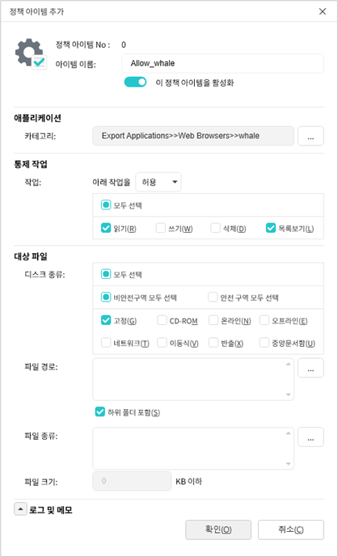

5. 다음과 같이 로컬저장금지 정책의 가장 위에 새로운 정책 아이템이 추가됩니다. 필요한 경우 상단 도구모음에 있는 **위로** 혹은 **아래로**를 클릭하여 정책 아이템의 우선순위를 변경합니다.

<figure>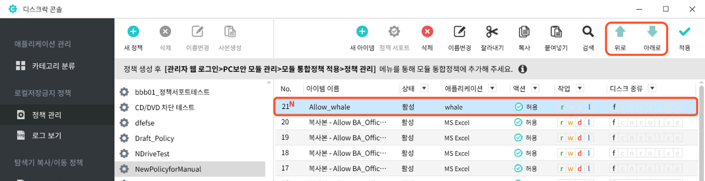<figcaption></figcaption></figure>

6. 계속해서 새 정책 아이템을 더 생성하려면 2 \~ 5번 과정을 반복합니다.&#x20;
7. 정책 아이템을 모두 생성한 후에는 상단 우측 도구모음에서 **적용**을 클릭하여 로컬저장금지 정책의 변경된 정보를 서버에 저장하고 적용합니다.&#x20;
8. 변경된 설정 정보가 서버에 정상적으로 적용되면 새로 생성한 정책 아이템에 표시된 붉은색 <mark style="color:$danger;">**N**</mark>이 사라집니다.

### <mark style="color:$primary;">정책 아이템 삭제하기</mark> 

로컬저장금지 정책에서 더 이상 필요하지 않은 정책 아이템은 다음과 같은 방법으로 삭제할 수 있습니다.&#x20;

1. 정책 관리 화면 왼쪽의 정책 목록에서 정책 아이템을 삭제할 로컬저장금지 정책을 선택합니다.
2. 선택한 정책을 구성하는 정책 아이템들이 오른쪽 화면에 표시됩니다. 삭제할 정책 아이템을 선택합니다. **\[Shift]** 키나 **\[Ctrl]** 키를 사용하여 여러 개의 정책 아이템을 선택할 수도 있습니다. 정책 아이템을 선택한 후 상단 우측 도구모음에서 **삭제**를 클릭합니다.

<figure>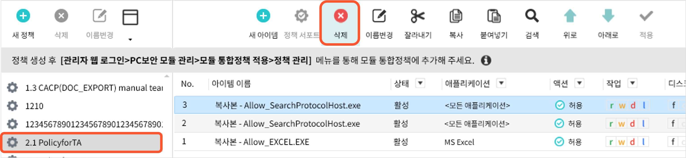<figcaption></figcaption></figure>

3. 삭제 여부를 확인하는 팝업 창이 나타나면 **예**를 클릭합니다.&#x20;
4. 도구모음의 **적용**을 클릭하여 정책의 변경 사항을 서버에 적용합니다.\
   &#x20;

### <mark style="color:$primary;">정책 아이템 수정하기</mark> 

로컬저장금지 정책에 추가된 정책 아이템을 수정하는 방법은 다음과 같습니다.

1. 정책 관리 화면 왼쪽의 정책 목록에서 정책 아이템을 수정할 로컬저장금지 정책을 선택합니다.&#x20;
2. 선택한 정책에 포함된 정책 아이템들이 오른쪽 화면에 표시됩니다. 수정할 정책 아이템을 더블클릭합니다&#x20;
3. 정책 아이템의 현재 설정 정보를 보여주는 **정책 아이템 설정** 화면이 나타납니다. [**정책 아이템 생성하기**](disklock-1.md)를 참고하여 수정이 필요한 항목들을 다시 설정한 후 **확인**을 클릭합니다.&#x20;
4. 도구모음의 **적용**을 클릭하여 정책의 변경 사항을 서버에 적용합니다.\
   &#x20;

### <mark style="color:$primary;">정책 아이템 우선순위 변경하기</mark> 

정책 아이템은 로컬저장금지 정책의 상단에 위치할수록 높은 우선순위를 가지고 우선적으로 적용됩니다. 새로운 정책 아이템을 추가하거나 다른 정책에 있던 정책 아이템을 가져오면 기본적으로 정책의 상단에 위치하게 되므로 우선순위를 조정해야 하는 경우가 생길 수 있습니다. 이러한 경우, 다음 설명을 참고하여 정책 아이템의 우선순위를 변경하도록 합니다.&#x20;

1. 정책 관리 화면의 정책 목록에서 정책 아이템의 우선 순위를 변경할 로컬저장금지 정책을 선택합니다.&#x20;
2. 선택한 정책을 구성하는 정책 아이템들이 오른쪽 화면에 표시됩니다. 우선순위를 변경할 정책 아이템을 선택합니다. **\[Shift]**, **\[Ctrl]** 키를 사용하여 여러 개의 정책 아이템을 선택할 수도 있습니다.&#x20;
3. 상단 우측 도구모음에서 **위로** 또는 **아래로**를 클릭하여 정책 아이템의 우선순위를 변경합니다. 정책의 우선순위를 높이려면 도구모음에서 **위로**를, 낮추려면 **아래로**를 클릭합니다. 원하는 우선순위로 이동할 때까지 해당 아이콘을 클릭합니다. 우선순위가 변경된 정책 아이템은 **No**항목 앞에 붉은색 점이 표시됩니다.&#x20;

<figure>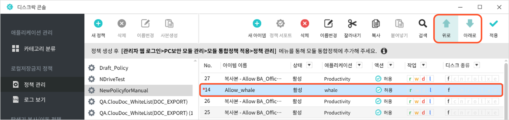<figcaption></figcaption></figure>

4. 정책 아이템의 우선순위를 모두 조정한 후에는 서버에 변경 사항이 적용되도록 도구모음의 **적용**을 클릭합니다.&#x20;

<figure>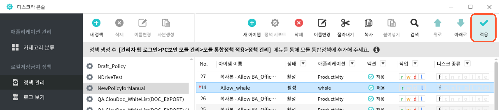<figcaption></figcaption></figure>

5. 정책의 변경 사항이 서버에 정상적으로 적용되면 우선순위를 조정한 정책 아이템의 **No** 항목 앞에 있던 붉은색  이 사라지고 **No** 항목도 변경된 우선순위에 맞게 다시 표시됩니다.&#x20;

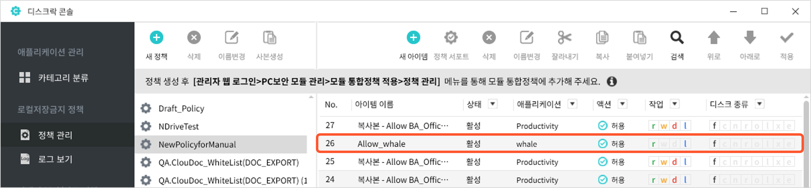

### <mark style="color:$primary;">정책 아이템 이름 변경하기</mark> 

정책 아이템의 이름을 변경하는 방법은 다음과 같습니다.&#x20;

1. 정책 관리 화면 왼쪽의 정책 목록에서 정책 아이템의 이름을 변경할 로컬저장금지 정책을 선택합니다.
2. 선택한 정책을 구성하는 정책 아이템들이 오른쪽 화면에 표시됩니다. 이름을 변경할 정책 아이템을 선택한 후 상단 우측 도구모음에서 **이름변경**을 클릭합니다.&#x20;
3. 선택한 정책 아이템의 이름이 수정 가능한 상태로 바뀝니다. 새로운 정책 아이템의 이름을 입력한 후 Enter 키를 누릅니다.

<figure>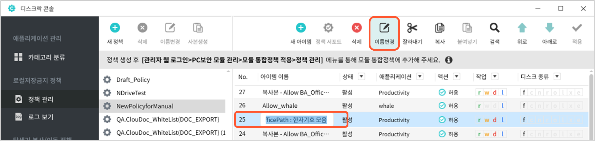<figcaption></figcaption></figure>

4. 이름을 변경한 정책 아이템은 아이템 이름 뒤에 붉은색 점이 표시됩니다. 도구모음의 적용을 클릭하여 정책의 변경 사항을 서버에 적용합니다.&#x20;

<figure>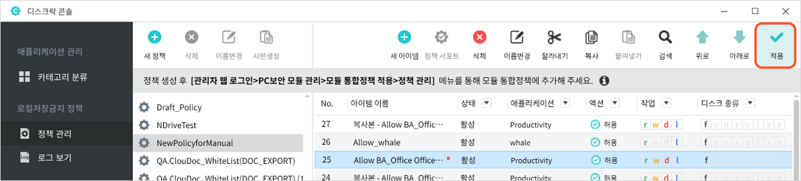<figcaption></figcaption></figure>

5. 변경 사항이 서버에 정상적으로 적용되면 붉은색 점이 사라집니다.

### <mark style="color:$primary;">정책 아이템 복사/이동하기</mark> 

다른 로컬저장금지 정책에 정의된 정책 아이템이 필요한 경우에는 새로 생성할 필요없이 다음과 같은 방법으로 복사하거나 이동할 수 있습니다.

1. 관리 화면 왼쪽의 정책 목록에서 복사 혹은 이동할 정책 아이템이 있는 로컬저장금지 정책을 선택합니다.&#x20;
2. 선택한 정책을 구성하는 정책 아이템들이 오른쪽 화면에 표시됩니다. 복사하거나 이동시킬 정책 아이템을 선택합니다. **\[Shift]** 키나 **\[Ctrl]** 키를 사용하여 여러 개의 정책 아이템을 선택할 수도 있습니다. 정책 아이템을 선택한 후 상단 우측 도구모음에서 **복사** 또는 **잘라내기**를 클릭합니다.

<figure>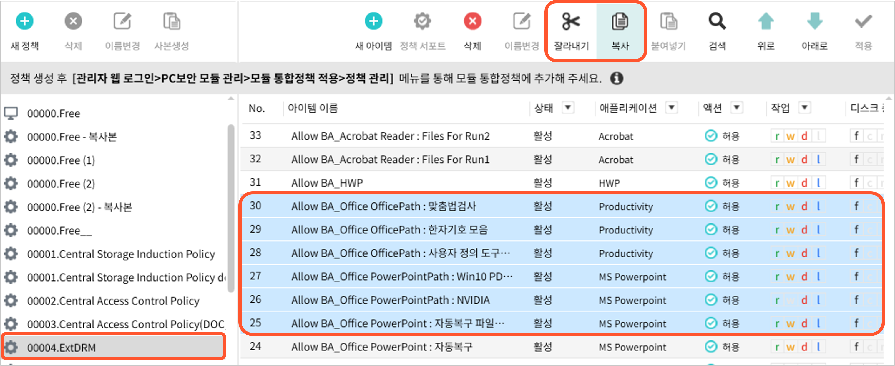<figcaption></figcaption></figure>

3. 정책 목록에서 선택한 정책 아이템을 복사하거나 이동시킬 정책을 선택한 후 상단 우측 도구모음에서 **붙여넣기**를 클릭합니다. 다음과 같이 기존 정책 아이템의 이름 앞에 **복사본**이 추가된 정책 아이템들이 추가됩니다.&#x20;

<figure>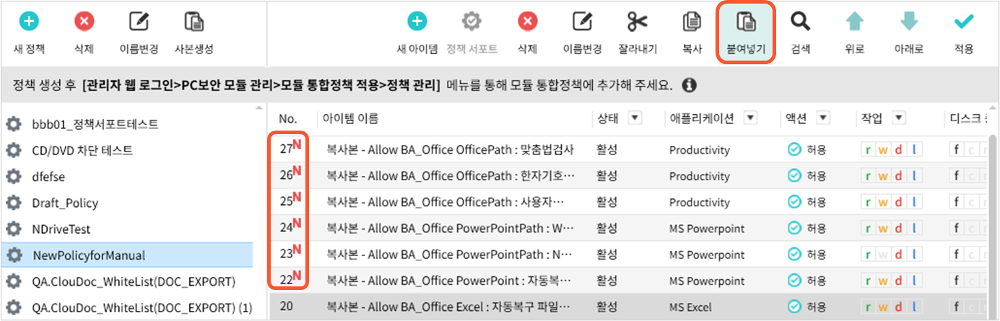<figcaption></figcaption></figure>

4. 복사된 정책 아이템은 정책의 가장 위에 추가됩니다. 필요한 경우 상단 도구모음에 있는 **위로** 혹은 **아래로**를 클릭하여 복사된 정책 아이템의 우선순위를 변경합니다.&#x20;
5. 상단 우측 도구모음의 **적용**을 클릭하여 서버에 정책의 변경 사항을 적용합니다.
6. 정책의 변경 사항이 서버에 정상적으로 적용되면 각 정책 아이템의 **No** 항목 앞에 있던 붉은색 **N**이 사라집니다.


도구모음의 잘라내기, 복사하기, 붙여넣기 대신 각각 \[Ctrl+X], \[Ctrl+C], \[Ctrl+V] 단축키를 사용할 수 있습니다.&#x20;


### <mark style="color:$primary;">정책 아이템 검색하기</mark> 

정책 아이템을 검색하는 방법은 다음과 같습니다.

1. 정책 관리 화면의 정책 목록에서 정책 아이템을 검색할 로컬저장금지 정책을 선택한 후 상단 우측 도구모음에서 **검색**을 클릭합니다.

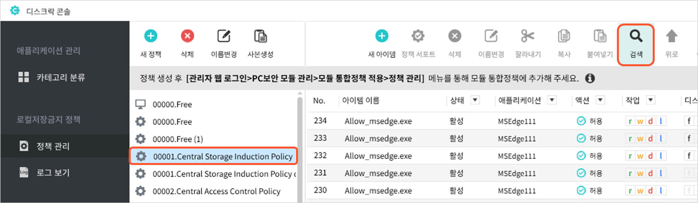

2. 다음과 같은 **로컬저장금지 정책 아이템 검색** 창이 나타납니다.

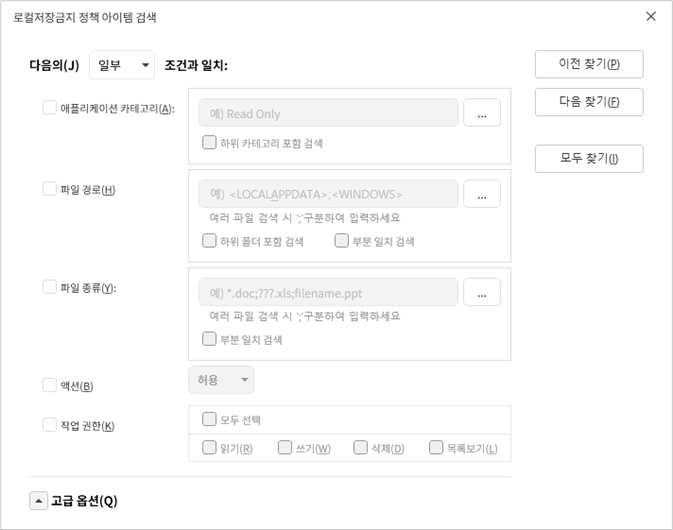

먼저 **다음의 조건과 일치** 드롭박스를 클릭하여 설정한 검색 조건들 중 일부만 일치하는 정책 아이템을 모두 검색할 것인지(**일부**) 아니면 모든 조건을 만족하는 정책 아이템만 검색할 것인지(**모든**)를 설정합니다.

<figure>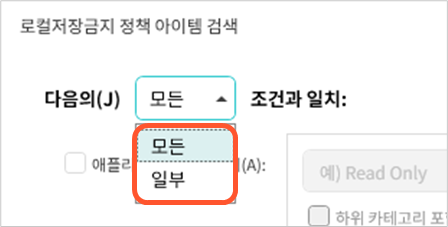<figcaption></figcaption></figure>

검색 조건을 지정할 항목을 체크하면 항목이 설정 가능한 상태로 바뀝니다. 다음 표를 참고하여 각 검색 항목들을 설정합니다.

<table><thead><tr><th width="174.45455932617188">항목</th><th>설명</th></tr></thead><tbody><tr><td><strong>애플리케이션 카테고리</strong></td><td>
검색하고자 하는 정책 아이템이 적용되는 애플리케이션 카테고리를 지정합니다. 

우측의  버튼을 클릭한 후 애플리케이션 <strong>카테고리 찾아보기</strong> 창이 나타나면 <strong>경로 구분</strong>과 <strong>애플리케이션 이름</strong> 항목에 각각 카테고리를 검색할 범위와 카테고리를 검색할 애플리케이션의 이름을 입력한 후 <strong>검색</strong>을 클릭합니다. 

애플리케이션 카테고리를 검색한 결과가 화면 아래 부분에 표시되면 정책이 적용될 카테고리를 선택하고 <strong>확인</strong>을 클릭합니다. 

 

<strong>하위 카테고리 포함 검색</strong> 항목을 체크하면 지정한 애플리케이션 카테고리의 하위 카테고리까지 검색 범위로 지정합니다.
</td></tr><tr><td><strong>파일 경로</strong></td><td>
특정한 파일 경로에 적용되는 정책 아이템을 검색하려면 이 항목에 해당 파일 경로를 입력합니다. 

직접 파일 경로를 입력할 수도 있고 오른쪽에 있는  버튼을 클릭하면 나타나는 다음과 같은 <strong>예약 폴더 선택</strong> 창에서 예약된 폴더를 선택할 수도 있습니다. 

<strong>하위 폴더 포함 검색</strong> 항목을 체크하면 지정한 파일 경로의 하위 폴더까지 검색 범위로 지정합니다. 

<strong>부분 일치 검색</strong> 항목을 체크하면 입력한 파일 경로의 일부분만 일치하는 정책 아이템도 검색됩니다.
</td></tr><tr><td><strong>파일 종류</strong></td><td>특정한 종류의 파일에만 작업 권한이 적용되는 정책 아이템을 검색하려면 이 항목에서 원하는 파일 종류(파일 확장자)를 지정합니다. <strong>*.doc</strong>와 같이 와일드 카드 문자를 사용할 수 있습니다. 여러 개를 지정할 경우에는 세미콜론(;)으로 구분합니다. 오른쪽에 있는 버튼을 클릭하면 <strong>파일 종류 선택</strong> 창이 나타나는데 이 창에서 미리 설정되어 있는 파일 종류를 선택할 수 있습니다. <strong>부분 일치 검색</strong> 항목을 체크하면 입력한 파일 종류의 일부분만 일치하는 정책 아이템도 검색합니다.</td></tr><tr><td><strong>액션</strong></td><td>드롭박스를 클릭한 후 검색하고자 하는 정책 아이템이 아래에 있는 <strong>작업 권한</strong> 항목에서 선택된 권한을 <strong>허용</strong> 또는 <strong>차단</strong>하는지 여부를 선택합니다.</td></tr><tr><td><strong>작업 권한</strong></td><td>
검색하고자 하는 정책 아이템이 허용 또는 차단하는 권한을 선택합니다. 모든 권한을 선택하려면 <strong>모두 선택</strong>을 체크합니다.

<ul><li><strong>읽기(R):</strong> 대상 파일을 읽을 수 있는 권한</li><li><strong>쓰기(W):</strong> 대상 파일을 변경하고 저장할 수 있는 권한</li><li><strong>삭제(D):</strong> 대상 파일을 삭제할 수 있는 권한</li><li><strong>목록보기(L):</strong> 대상 파일의 정보를 읽을 수 있는 권한</li></ul></td></tr></tbody></table>

3. 디스크 종류, 파일 크기, 로그의 설정 여부와 같은 검색 조건을 추가로 설정하고자 하는 경우에는 **고급 옵션**의 왼쪽에 있는 ▲를 클릭합니다.&#x20;
4. 다음과 같이 추가 검색 조건 항목들이 나타납니다.&#x20;

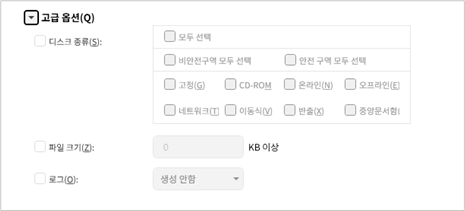

검색 조건을 지정할 항목을 체크하면 항목이 설정 가능한 상태로 바뀝니다. 다음 표를 참고하여 각각의 검색 항목들을 설정합니다.

<table><thead><tr><th width="145.36361694335938">항목</th><th>Text</th></tr></thead><tbody><tr><td><strong>디스크 종류</strong></td><td>
검색할 정책 아이템이 적용되는 디스크를 선택합니다.
<ul><li><strong>모두선택</strong>: 모든 디스크</li><li><strong>비안전구역 모두 선택</strong>:고정, CD-ROM, 네트워크, 이동식 디스크</li><li><strong>안전구역 모두 선택</strong>: 온라인, 오프라인, 반출, 중앙문서함</li></ul>

<mark style="color:$warning;">보안디스크에 대한 상세한 설명은</mark> <a href="https://github.com/manualcloudoc/mcloudoc-user-manual/blob/main/zoho-export/markdown/%EC%82%AC%EC%9A%A9%EC%9E%90-%EB%A7%A4%EB%89%B4%EC%96%BC/disklock/%EB%B3%B4%EC%95%88%EB%94%94%EC%8A%A4%ED%81%AC-%EC%86%8C%EA%B0%9C.md"><mark style="color:$warning;"><strong>보안디스크 소개</strong></mark></a><mark style="color:$warning;">의 내용을 참고합니다.</mark>
</td></tr><tr><td><strong>파일 크기</strong></td><td>특정한 크기 이상의 파일에만 적용되는 정책 아이템을 검색하려면 이 항목에서 파일 크기를 KB 단위로 입력합니다.</td></tr><tr><td><strong>로그</strong></td><td>드롭박스를 클릭한 후 검색할 정책 아이템의 로그 생성 여부를 선택합니다.</td></tr></tbody></table>

5. 필요한 검색 조건을 모두 설정하였으면 **이전 찾기**, **다음 찾기**, 또는 **모두 찾기** 중 하나를 클릭하여 검색을 시작합니다.

•   **이전 찾기**:

조건에 일치하는 정책 아이템을 오름차순으로 검색합니다. 이 버튼을 처음 클릭하면 검색 조건과 일치하는 가장 낮은 우선순위의 정책 아이템이 검색됩니다. 이 후에는 클릭할 때마다 그 다음으로 높은 우선순위의 정책 아이템이 검색됩니다.

<figure>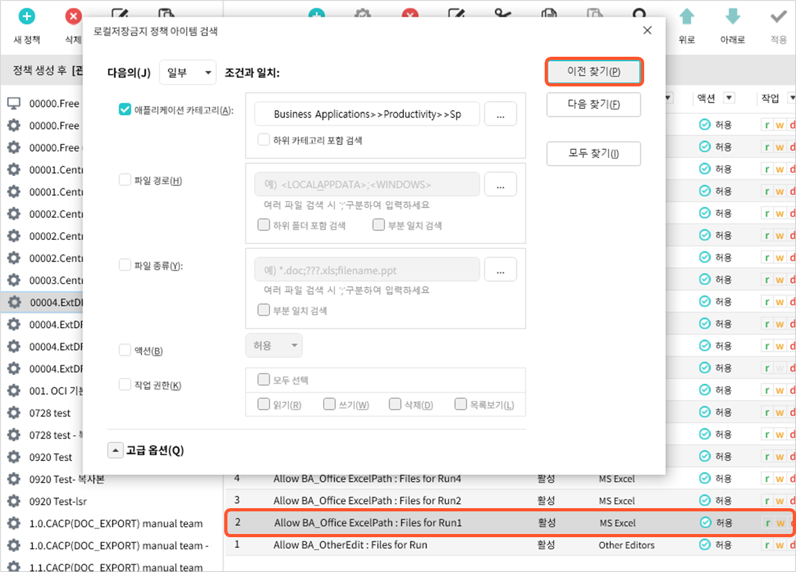<figcaption></figcaption></figure>

•   **다음 찾기**:&#x20;

조건에 일치하는 정책 아이템을 내림차순으로 검색합니다. 이 버튼을 처음 클릭하면 검색 조건과 일치하는 가장 높은 우선순위의 정책 아이템이 검색됩니다. 이 후에는 클릭할 때마다 그 다음으로 낮은 우선순위의 정책 아이템이 검색됩니다.

<figure>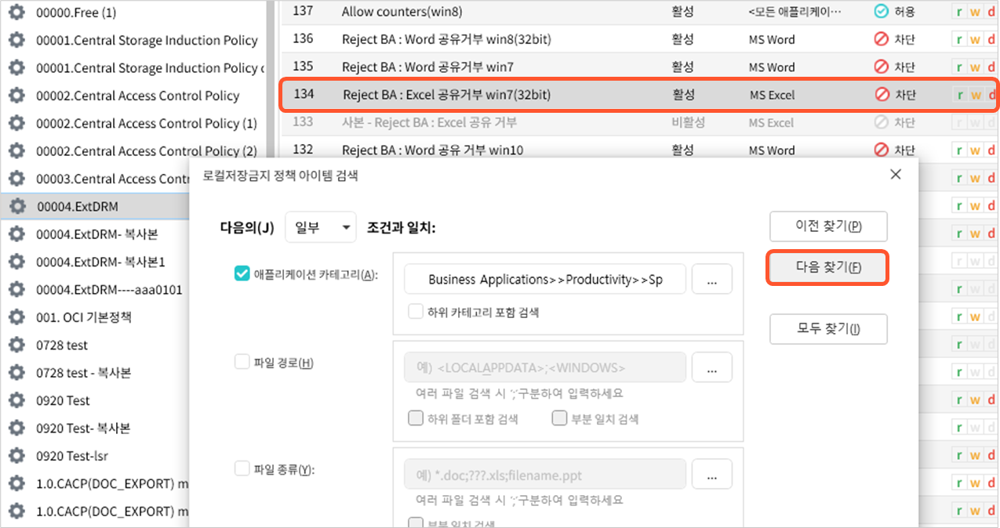<figcaption></figcaption></figure>

•   **모두 찾기**:&#x20;

조건에 일치하는 정책 아이템을 모두 검색하여 창 하단의 **검색결과** 목록에 표시합니다. 정책 아이템은 우선순위로 정렬되어 있는데 목록의 가장 위에 있는 정책 아이템이 가장 높은 우선순위이 정책 아이템입니다. 검색 결과 목록에서 정책 아이템을 클릭하면 관리 화면의 정책 아이템도 함께 선택됩니다.

<figure>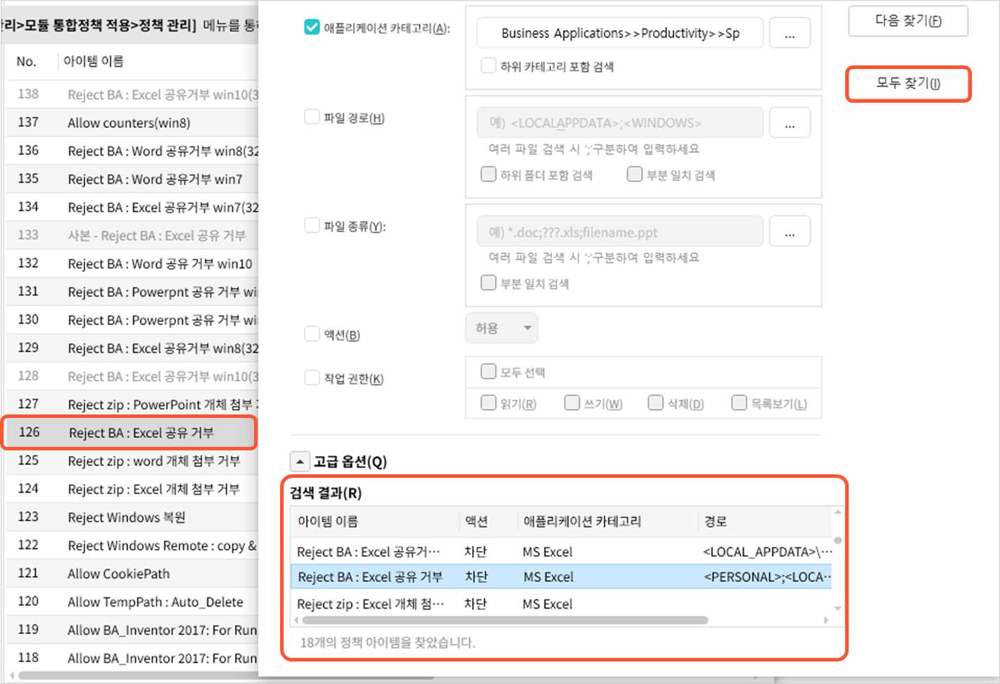<figcaption></figcaption></figure>

### <mark style="color:$primary;">정책 아이템의 애플리케이션 카테고리 재지정하기</mark> 

로컬저장금지 정책의 정책 아이템에서 사용 중이던 애플리케이션 카테고리가 삭제되는 경우가 있습니다. 삭제된 애플리케이션을 사용하는 정책 아이템이 포함된 로컬저장금지 정책을 **적용**하면 다음과 같이 등록되지 않은 애플리케이션을 사용하는 정책 아이템이 있음을 알려주는 팝업 창이 나타납니다.

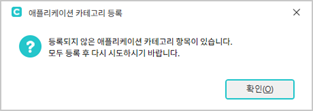

**확인**을 눌러 창을 닫은 후 다음 설명을 참고하여 정책 아이템의 애플리케이션 카테고리를 다시 지정합니다.

1. 팝업 창을 닫으면 다음과 같은 **애플리케이션 카테고리** 등록 창이 나타납니다.

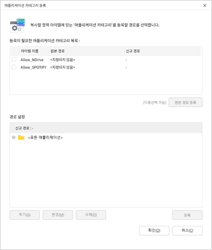

2. **등록이 필요한 애플리케이션 카테고리 목록**에는 애플리케이션 카테고리를 지정해야 할 정책 아이템들이 표시됩니다. 목록에서 애플리케이션 카테고리를 다시 지정할 정책 아이템을 체크해서 선택합니다.
3. 정책 아이템을 선택한 후에는 화면 아래의 경로 설정에 있는 애플리케이션 카테고리 트리에서 새로 지정할 애플리케이션 카테고리를 선택합니다. 카테고리 왼쪽의 \*\*+\*\*를 클릭하거나 더블클릭하면 하위 애플리케이션 카테고리를 볼 수 있습니다. 원하는 카테고리가 없는 경우에는 트리 아래에 있는 **추가**를 클릭하여 카테고리를 새로 추가하거나 **수정**을 클릭하여 카테고리의 이름을 변경할 수 있습니다. 애플리케이션 카테고리를 선택한 후에는 **등록**을 클릭합니다.&#x20;

<figure>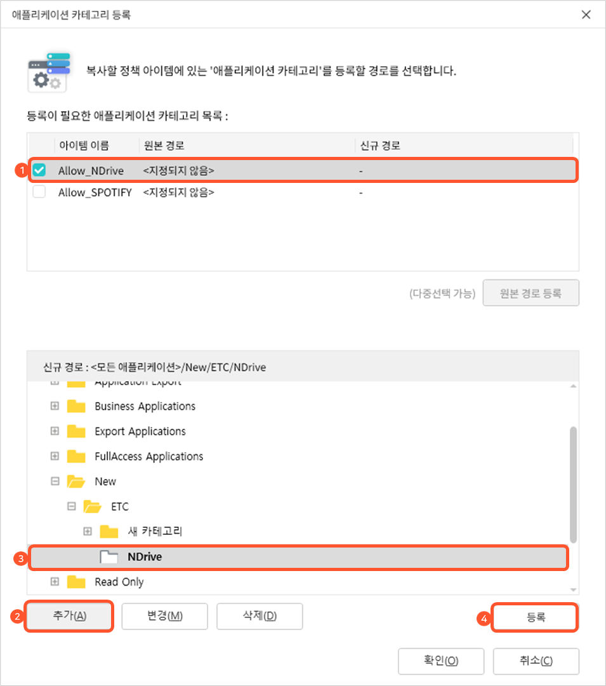<figcaption></figcaption></figure>


화면 하단에 있는 **추가**나 **변경**을 클릭하여 새로운 애플리케이션 카테고리를 추가하거나 변경한 후에 카테고리를 신규 경로로 지정하지 않으면 **애플리케이션 카테고리 등록** 창이 닫힐 때 애플리케이션 카테고리 트리에서 삭제됩니다. **삭제**는 **애플리케이션 카테고리 등록** 창에서 생성한 카테고리를 삭제할 때만 사용할 수 있고 기존에 생성되어 있는 카테고리는 삭제할 수 없습니다.&#x20;


4. 새로 지정한 애플리케이션 카테고리를 새로운 경로로 설정할지 묻는 팝업 창이 나타나면 **확인**을 클릭합니다.
5. 목록에 있는 다른 정책 아이템도 2 \~ 4번 과정을 반복하여 모두 애플리케이션 카테고리를 지정한 후 **확인**을 클릭합니다.
