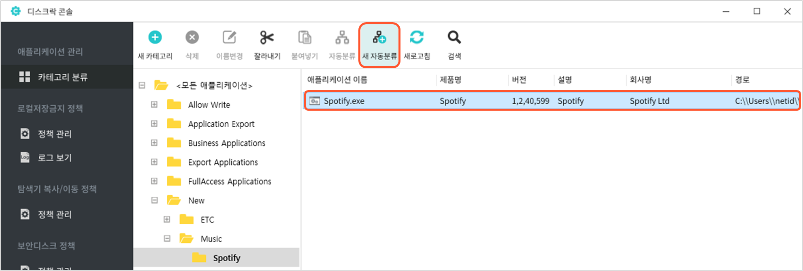
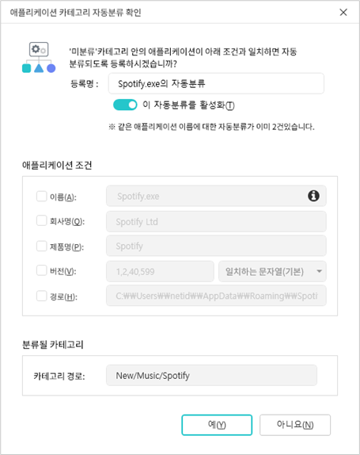
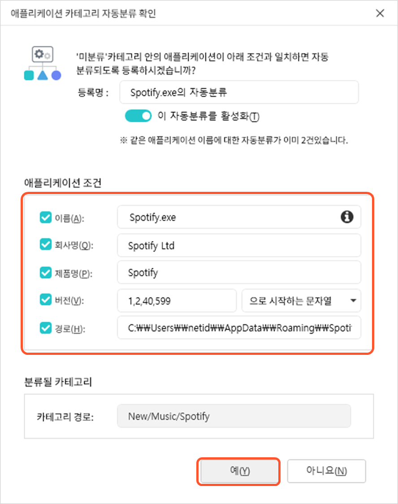
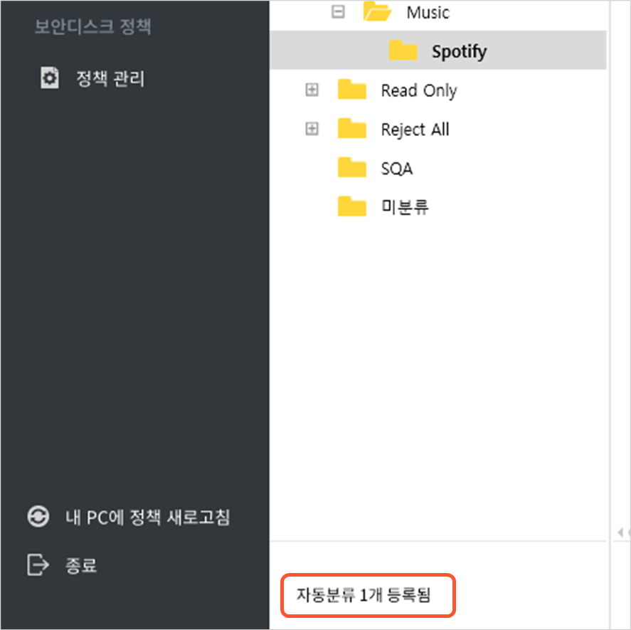
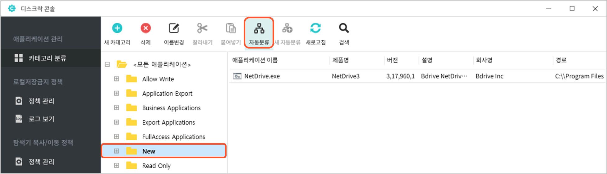
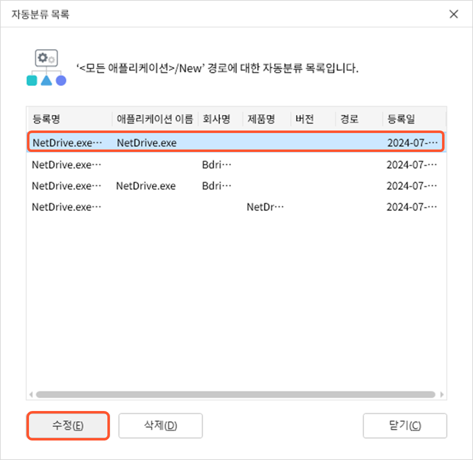
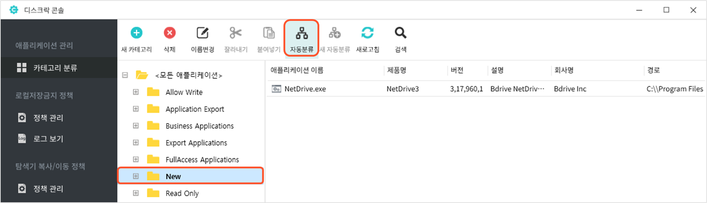
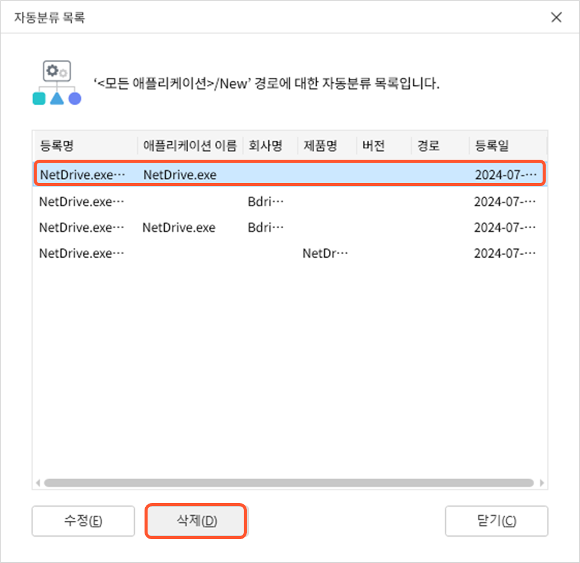
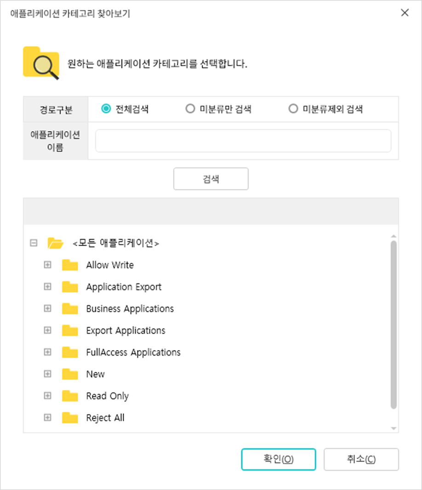

# DiskLock 콘솔에서 애플리케이션 카테고리 관리하기

### <mark style="color:$primary;">애플리케이션 관리 화면 살펴보기</mark>

애플리케이션 카테고리를 관리하기 위해서는 DiskLock 콘솔에서 **애플리케이션 관리 - 카테고리 분류** 메뉴를 선택합니다. 다음과 같이 .png>) **애플리케이션 카테고리 트리**, .png>)**도구모음**,  **애플리케이션 목록**으로 구성된 애플리케이션 관리 화면이 나타납니다.

.png>)

#### 애플리케이션 카테고리 트리

현재 정의된 애플리케이션 카테고리의 계층 구조를 트리 형태로 보여주는 부분입니다. 하위 애플리케이션 카테고리가 있는 경우에는 애플리케이션 카테고리를 더블 클릭하거나 이름 왼쪽의 +를 클릭하면 하위 애플리케이션 카테고리가 표시됩니다. 카테고리로 분류된 애플리케이션이 있으면 카테고리 이름을 클릭했을 때 해당 카테고리로 분류된 애플리케이션의 목록이 우측 부분에 표시됩니다.

애플리케이션 카테고리 트리의 최상위 카테고리는 **<모든 애플리케이션>**&#xC774;고 모든 애플리케이션 카테고리가 이 카테고리 아래에 위치합니다. 트리의 가장 아래에는 미분류 카테고리가 있습니다. 사용자 PC에서 실행된 새로운 애플리케이션 중 **자동 분류**가 설정되어 있지 않은 애플리케이션은 기본적으로 미분류 카테고리로 분류됩니다.

애플리케이션 카테고리 트리에서 카테고리를 선택하고 마우스를 우클릭하면 하위 카테고리를 추가하거나 선택한 카테고리를 삭제하거나 이름을 변경할 수 있는 메뉴로 구성된 **컨텍스트 메뉴**가 나타납니다.

####  도구모음

도구모음에는 애플리케이션 카테고리를 관리하는 데 필요한 기능들이 아이콘 형태로 제공됩니다. 도구모음의 아이콘은 현재 상황에서 사용할 수 있는 아이콘만 활성화됩니다. 각 아이콘의 기능은 다음과 같습니다.

<table data-search="false"><thead><tr><th width="137.72723388671875">아이콘</th><th>기능</th></tr></thead><tbody><tr><td><strong>새 카테고리</strong></td><td>애플리케이션 카테고리 트리에서 선택한 카테고리에 새로운 하위 카테고리를 만듭니다.</td></tr><tr><td><strong>삭제</strong></td><td>애플리케이션 카테고리 트리에서 선택한 카테고리를 삭제합니다. &#x3C;모든 애플리케이션>과 ‘미분류’ 카테고리는 삭제할 수 없습니다.</td></tr><tr><td><strong>이름변경</strong></td><td>애플리케이션 카테고리 트리에서 선택한 카테고리의 이름을 변경합니다.</td></tr><tr><td><strong>잘라내기</strong></td><td>애플리케이션 목록에서 선택한 애플리케이션을 다른 카테고리로 이동하기 위해 잘라냅니다.</td></tr><tr><td><strong>붙여넣기</strong></td><td>잘라내기 메뉴를 사용하여 복사한 애플리케이션을 현재 선택된 카테고리로 붙여 넣고 기존의 카테고리에서 삭제합니다.</td></tr><tr><td><strong>자동분류</strong></td><td>애플리케이션 카테고리 트리에서 선택한 카테고리에 속한 애플리케이션에 설정된 자동분류 목록을 출력하고, 자동분류를 수정하거나 삭제합니다.</td></tr><tr><td><strong>새 자동분류</strong></td><td>애플리케이션 목록에서 선택한 애플리케이션과 유사한 새 애플리케이션이 실행될 경우 해당 애플리케이션이 속한 카테고리로 자동 분류될 수 있도록 자동분류를 설정합니다.</td></tr><tr><td><strong>새로고침</strong></td><td>서버로부터 최신 정보를 가져와 화면의 애플리케이션 카테고리와 애플리케이션 목록을 업데이트합니다.</td></tr><tr><td><strong>검색</strong></td><td>특정 애플리케이션이 속한 카테고리를 검색합니다. 카테고리를 변경하거나 자동분류를 설정할 애플리케이션을 찾을 때 유용하게 사용할 수 있습니다.</td></tr></tbody></table>

#### 애플리케이션 목록

애플리케이션 카테고리 트리에서 카테고리를 클릭했을 때 해당 카테고리로 분류된 애플리케이션들의 목록이 표시되는 부분입니다. 다음 화면은 **Export Applications > Email > MS Outlook 카테고리** 를 클릭했을 때 볼 수 있는 화면입니다.

.png>)

가로 스크롤바 를 사용하여 화면을 오른쪽으로 이동시키면 애플리케이션에 대한 모든 항목들을 볼 수 있습니다. 다음은 애플리케이션의 각 항목이 나타내는 정보입니다.

<table data-search="false"><thead><tr><th width="185">항목</th><th>설명</th></tr></thead><tbody><tr><td><strong>애플리케이션 이름</strong></td><td>애플리케이션의 실행 파일 이름(프로세스명)</td></tr><tr><td><strong>제품명</strong></td><td>애플리케이션의 제품 이름</td></tr><tr><td><strong>버전</strong></td><td>애플리케이션의 버전 정보</td></tr><tr><td><strong>설명</strong></td><td>애플리케이션에 대한 설명</td></tr><tr><td><strong>회사명</strong></td><td>애플리케이션 개발 회사 이름</td></tr><tr><td><strong>경로</strong></td><td>애플리케이션이 실행 파일이 저장된 경로</td></tr><tr><td><strong>파일 크기</strong></td><td>애플리케이션 실행 파일의 크기(MB)</td></tr><tr><td><strong>등록일</strong></td><td>애플리케이션이 처음 실행되어 서버에 등록된 날짜와 시간</td></tr></tbody></table>

우측 하단 에는 해당 카테고리로 분류된 애플리케이션의 개수가 표시됩니다. 드롭박스에서 한 번에 출력될 애플리케이션의 최대 개수(n개)를 지정할 수 있으며 **더보기**를 눌러 다음 n개의 애플리케이션의 정보를 추가로 출력할 수 있습니다. \
​\
애플리케이션 카테고리 트리 아래에 표시되는 **자동분류 개수**는 선택된 애플리케이션 카테고리로 애플리케이션을 자동으로 분류해주는 자동분류가 설정된 개수를 나타냅니다.

애플리케이션 목록에서 마우스를 우클릭하면 애플리케이션을 다른 카테고리로 옮길 수 있도록 잘라내거나 자동 분류를 설정하거나 최신 정보로 화면을 업데이트할 수 있는 컨텍스트 메뉴가 나타납니다.

<figure><figcaption></figcaption></figure>

### <mark style="color:$primary;">애플리케이션 카테고리 생성하기</mark>

새로운 애플리케이션 카테고리를 생성하는 방법은 다음과 같습니다.

1. 애플리케이션 관리 화면의 애플리케이션 카테고리 트리에서 생성할 새로운 애플리케이션 카테고리의 **상위 카테고리**를 선택합니다. 미분류 카테고리는 선택할 수 없습니다.
2. 도구모음에서 **새 카테고리**를 클릭하거나 마우스를 우클릭해서 나타난 컨텍스트 메뉴에서 **새 카테고리**를 선택합니다. &#x20;

<figure><figcaption></figcaption></figure>

3. 상위 카테고리 아래에 다음과 같이 **새 카테고리**라는 이름의 애플리케이션 카테고리가 만들어집니다.&#x20;

<figure><figcaption></figcaption></figure>

4. 카테고리의 이름을 입력하고 Enter키를 누릅니다.&#x20;
5. [**애플리케이션 분류하기**](mgmtcategory.md#classify) 내용을 참고하여 애플리케이션을 새로 만들어진 카테고리로 분류합니다. &#x20;

### <mark style="color:$primary;">애플리케이션 카테고리 삭제하기</mark>

더 이상 사용하지 않을 애플리케이션 카테고리는 다음과 같은 방법으로 삭제할 수 있습니다.&#x20;


애플리케이션 카테고리에 하위 카테고리가 있거나 해당 카테고리로 분류되는 애플리케이션이 있거나 자동분류가 설정되어 있으면 삭제할 수 없습니다. 해당 카테고리로 분류되는 애플리케이션이 있는 경우에는 [**직접 분류할 애플리케이션 카테고리 지정하기**](mgmtcategory.md#direct)를 참고하여 애플리케이션을 다른 카테고리로 옮깁니다. 자동분류가 설정되어 있는 경우에는 [**애플리케이션 자동분류 삭제하기**](mgmtcategory.md#deleteauto)를 참고하여 자동분류를 삭제합니다.&#x20;


1. 애플리케이션 관리 화면의 애플리케이션 카테고리 트리에서 삭제할 애플리케이션 카테고리를 선택합니다.
2. 도구모음에서 **삭제**를 클릭하거나 마우스를 우클릭해서 나타난 컨텍스트 메뉴에서 **삭제**를 선택합니다. 하위 카테고리가 있는 경우에는 하위 카테고리를 먼저 삭제해야 합니다.

<figure><figcaption></figcaption></figure>

3. 선택한 애플리케이션 카테고리를 삭제할지 확인하는 창이 나타나면 **예**를 클릭합니다.&#x20;


애플리케이션 카테고리 중 **미분류** 카테고리는 삭제할 수 없습니다.


### <mark style="color:$primary;">애플리케이션 카테고리 이름 변경하기</mark>

애플리케이션 카테고리의 이름을 변경하는 방법은 다음과 같습니다.

1. 애플리케이션 관리 화면의 애플리케이션 카테고리 트리에서 이름을 변경할 애플리케이션 카테고리를 선택합니다.
2. 도구모음에서 **이름변경**을 클릭하거나 마우스를 우클릭해서 나타난 컨텍스트 메뉴에서 **이름변경**을 선택합니다.&#x20;

3. 선택한 애플리케이션 카테고리의 이름이 수정 가능한 상태로 바뀌면 새로운 이름을 입력한 후 **Enter** 키를 누릅니다.


애플리케이션 카테고리 중 **<모든 애플리케이션>**&#xACFC; **미분류** 카테고리의 이름은 변경할 수 없습니다.


### <mark style="color:$primary;">애플리케이션 분류하기</mark> 

#### 애플리케이션 분류 과정

DiskLock 기능을 사용하고 있을 때에는 사용자의 PC에서 실행하는 모든 애플리케이션은 반드시 하나의 애플리케이션 카테고리로 분류되어야 합니다. 사용자가 PC에서 새로운 애플리케이션을 실행하면 다음과 같은 과정을 통해 특정 애플리케이션 카테고리로 분류됩니다.

>  사용자 PC에서 새로운 애플리케이션을 실행합니다.
>
>  서버에서 새로운 애플리케이션을 등록하고 해당 애플리케이션이 현재 설정된 자동분류에 의해 분류될 수 있는 대상인지 확인합니다.
>
>  자동분류 대상이면 자동분류의 설정에 따라 해당 애플리케이션을 특정 카테고리로 분류합니다.
>
>  자동분류 대상이 아니면 **미분류** 카테고리로 분류됩니다.
>
>  미분류 카테고리로 분류된 애플리케이션은 사용자가 직접 **원하는 카테고리**로 이동시켜야 합니다. 이후 이 애플리케이션과 유사한 새 애플리케이션이 실행될 경우 자동으로 해당 카테고리로 분류되도록 하려면 **자동분류**를 설정합니다.

\~ 단계는 자동으로 수행되고 단계는 사용자가 수행해야 합니다. 단계에서 직접 원하는 카테고리로 애플리케이션을 이동시켜 분류하는 방법과 애플리케이션이 특정 카테고리에 자동으로 분류될 수 있도록 자동분류를 설정하는 방법에 대해 차례로 살펴봅니다.&#x20;


애플리케이션 **자동분류**는 DiskLock 콘솔 외에도 웹의 **PC 보안 모듈 관리 > DiskLock > 로컬저장금지 > 애플리케이션 카테고리 자동등록** 메뉴를 사용하여 설정할 수 있습니다. 이 메뉴를 사용하여 자동분류를 등록하는 방법은 [**애플리케이션 카테고리 자동등록 설정하기**](../undefined-6.md)를 참고합니다.


#### 직접 분류할 애플리케이션 카테고리 지정하기 

사용자가 직접 미분류 카테고리에 있는 애플리케이션을 특정 카테고리로 분류하거나 이미 분류된 애플리케이션을 다른 카테고리로 이동하는 방법은 다음과 같습니다.&#x20;

1. 애플리케이션 관리 화면의 애플리케이션 트리에서 카테고리를 변경할 애플리케이션이 속한 카테고리를 클릭합니다.


애플리케이션이 어떤 카테고리로 분류되는지 모르거나 카테고리로 분류되는 애플리케이션 개수가 많아서 찾기 어려운 경우에는 ‘애플리케이션 카테고리 검색’ 기능을 사용합니다. 검색 기능을 사용하여 애플리케이션 카테고리를 찾는 방법은 [**애플리케이션 카테고리 검색하기**](mgmtcategory.md#search)를 참고합니다.


2. 화면 우측에 해당 카테고리에 속한 애플리케이션 목록이 표시되면 카테고리를 지정할 애플리케이션을 클릭합니다.&#x20;
3. 도구모음에서 **잘라내기**를 클릭하거나 마우스를 우클릭해서 나타난 컨텍스트 메뉴에서 **잘라내기**를 선택합니다.

<figure><figcaption></figcaption></figure>

4. 애플리케이션 카테고리 트리에서 잘라 낸 애플리케이션이 속할 카테고리를 클릭합니다.
5. 도구모음에서 **붙여넣기**를 클릭하거나 마우스를 우클릭해서 나타난 컨텍스트 메뉴에서 **붙여넣기**를 선택합니다.&#x20;

<figure><figcaption></figcaption></figure>


**잘라내기** 메뉴와 **붙여넣기** 메뉴 대신 Ctrl+X와 Ctrl+V 단축키를 사용하거나 마우스 드래그 앤 드롭으로 애플리케이션을 원하는 카테고리로 이동할 수 있습니다. &#x20;


#### 애플리케이션 자동분류 설정하기 

다음은 설정한 조건과 일치하는 새 애플리케이션이 등록될 때 지정한 카테고리에 자동으로 분류되도록 자동분류를 설정하는 과정입니다.

1. 애플리케이션 관리 화면의 애플리케이션 트리에서 자동분류를 설정할 애플리케이션이 속한 카테고리를 클릭합니다.&#x20;
2. 클릭한 카테고리에 속한 애플리케이션 목록이 우측 화면에 표시되면 자동분류를 설정할 애플리케이션을 클릭합니다.&#x20;


애플리케이션이 어떤 카테고리로 분류되는지 모르거나 카테고리로 분류되는 애플리케이션 개수가 많아서 찾기 어려운 경우에는 ‘애플리케이션 카테고리 검색’ 기능을 사용합니다. 검색 기능을 사용하여 애플리케이션 카테고리를 찾는 방법은 [**애플리케이션 카테고리 검색하기**](mgmtcategory.md#search)를 참고합니다.​


3. 도구모음에서 **새 자동분류**를 클릭하거나 애플리케이션을 마우스 우클릭해서 나타난 컨텍스트 메뉴에서 **새 자동분류**를 선택합니다.&#x20;

<figure><figcaption></figcaption></figure>

4. **애플리케이션 카테고리 자동분류 확인** 창이 나타납니다. 그림 아래에 있는 설명을 참고하여 각 항목의 값을 설정합니다.

<table><thead><tr><th width="176.81817626953125">항목</th><th>기능</th></tr></thead><tbody><tr><td><strong>등록명</strong></td><td>추가할 자동분류의 이름을 입력합니다. 기본적으로 ‘&#x3C;애플리케이션 이름>의 자동 분류’로 등록명이 만들어집니다.</td></tr><tr><td><strong>이 자동 분류를 활성화</strong></td><td>추가할 자동분류의 활성화 여부를 선택합니다.</td></tr><tr><td><strong>애플리케이션 조건</strong></td><td>
자동분류 대상이 될 애플리케이션의 조건을 설정합니다. 조건들은 기본적으로 선택한 애플리케이션의 정보로 설정되어 있습니다. 필요한 경우 다음 설명을 참고하여 이 조건들을 변경합니다.
<ul><li><strong>이름</strong>: 자동분류를 적용할 애플리케이션 이름을 지정합니다. 와일드카드 문자(*,?)를 사용하여 여러 애플리케이션에 적용되도록 설정할 수도 있습니다. </li><li><strong>회사명</strong>: 자동분류를 적용할 애플리케이션의 회사이름을 입력합니다. </li><li><strong>제품명</strong>: 자동분류를 적용할 애플리케이션의 제품 이름을 입력합니다.</li><li><strong>버전</strong>: 애플리케이션의 버전을 입력합니다. 입력한 버전과 완전히 동일한 경우에만 자동분류를 적용하려면 우측 드롭다운 목록에서 ‘일치하는 문자열(기본)’을, 입력한 버전 뒷부분에 추가로 버전 정보가 있는 경우에도 적용하려면 ‘으로 시작하는 문자열’을 선택합니다. </li><li><strong>경로</strong>: 특정한 경로에 저장된 애플리케이션만 자동분류를 적용하려는 경우 이 항목에 해당 경로를 입력합니다.</li></ul></td></tr><tr><td><strong>분류될 카테고리</strong></td><td><strong>애플리케이션 조건</strong>에서 설정한 조건을 모두 만족하는 애플리케이션이 새로 등록될 경우 자동으로 분류될 카테고리의 경로입니다. 이 항목은 사용자가 지정할 수 없고 선택한 애플리케이션이 현재 속해 있는 카테고리로 자동 지정됩니다.</td></tr></tbody></table>

5. 필요한 항목들의 값을 모두 설정한 후 **확인**을 클릭합니다.&#x20;

<figure><figcaption></figcaption></figure>

6. 설정한 자동분류가 추가됩니다. 자동분류가 추가되면 애플리케이션 카테고리 트리의 하단에 표시된 자동분류의 개수가 증가합니다. &#x20;

<figure><figcaption></figcaption></figure>

7. 해당 애플리케이션 카테고리와 관련된 자동분류를 추가로 설정하려면 3 \~ 6번 과정을 반복하면 됩니다.

#### 애플리케이션 자동분류 수정하기 

다음은 애플리케이션 카테고리에 설정되어 있는 자동분류를 수정하는 방법입니다.

1. 애플리케이션 관리 화면의 애플리케이션 트리에서 설정된 자동분류를 수정할 카테고리를 선택한 후 도구모음에서 **자동분류**를 클릭합니다.&#x20;

2. 선택한 애플리케이션 카테고리에 현재 설정되어 있는 자동분류 목록을 보여주는 **자동 분류 목록**창이 나타납니다. 목록에서 수정할 자동분류를 선택한 후 **수정**을 클릭합니다.

3. **애플리케이션 카테고리 자동 분류 확인** 창이 나타납니다. [**애플리케이션 자동분류 설정하기**](mgmtcategory.md#createauto)의 내용을 참고하여 수정이 필요한 항목을 다시 설정한 후 **예**를 클릭합니다.&#x20;
4. 수정할 자동분류가 더 있으면 2 \~ 3번 과정을 반복하면 됩니다. 더 이상 수정할 자동분류가 없으면 **닫기**를 눌러 창을 닫습니다.

#### 애플리케이션 자동분류 삭제하기 

다음은 애플리케이션 카테고리에 설정되어 있는 자동분류를 삭제하는 방법입니다.

1. 애플리케이션 관리 화면의 애플리케이션 트리에서 설정된 자동분류를 삭제할 카테고리를 선택한 후 도구모음에서 **자동분류**를 클릭합니다.&#x20;

<figure><figcaption></figcaption></figure>

2. 선택한 애플리케이션 카테고리에 현재 설정되어 있는 자동분류 목록을 보여주는 **자동 분류 목록**창이 나타납니다. 목록에서 삭제할 자동분류를 선택한 후 **삭제**를 클릭합니다.

<figure><figcaption></figcaption></figure>

3. 자동분류의 삭제 여부를 확인하는 창이 나타나면 **예**를 클릭합니다.
4. 선택한 자동분류가 목록에서 삭제됩니다. 삭제할 자동분류가 더 있으면 2 \~ 3번 과정을 반복하면 됩니다. 더 이상 삭제할 자동분류가 없으면 **닫기**를 눌러 창을 닫습니다.

### <mark style="color:$primary;">애플리케이션 카테고리 검색하기</mark> 

검색 기능을 사용하여 특정 애플리케이션이 속해 있는 카테고리를 찾는 방법은 다음과 같습니다.

1. 화면 상단 도구모음에서 **검색**을 클릭합니다.&#x20;
2. **애플리케이션 카테고리 찾아보기** 창이 나타납니다. 그림 아래의 설명을 참고하여 각 항목의 값을 설정합니다.

<table><thead><tr><th width="157.727294921875">항목</th><th>기능</th></tr></thead><tbody><tr><td><strong>경로구분</strong></td><td>
 검색할 카테고리 범위를 지정합니다.

<ul><li>전체검색: 모든 카테고리에서 애플리케이션 검색</li><li>미분류만 검색: 미분류 카테고리에서만 애플리케이션 검색</li><li>미분류제외 검색: 미분류를 제외한 나머지 카테고리에서 애플리케이션 검색</li></ul></td></tr><tr><td><strong>애플리케이션 이름</strong></td><td>검색할 애플리케이션의 이름을 입력합니다. 이름은 대소문자를 구분하지 않고 이름의 일부분만 입력하는 것도 가능합니다.</td></tr></tbody></table>

3. 검색할 애플리케이션과 카테고리 범위를 설정하였으면 **검색**을 클릭합니다.

4. 애플리케이션 카테고리를 검색한 결과가 화면 아래 부분에 표시됩니다. **애플리케이션 이름**으로 지정한 문자열이 포함된 애플리케이션(애플리케이션 이름)과 해당 애플리케이션이 속해 있는 카테고리의 전체 경로를 볼 수 있습니다. 검색 결과에서 사용자가 찾으려고 했던 애플리케이션을 선택하고 **확인**을 클릭합니다.&#x20;

<figure><figcaption></figcaption></figure>

5. **애플리케이션 찾아보기** 창이 닫히고 다음과 같이 애플리케이션 관리 화면에 해당 애플리케이션이 속한 카테고리와 애플리케이션이 표시됩니다. ​

<figure><figcaption></figcaption></figure>
