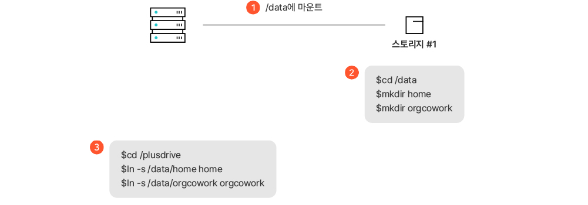
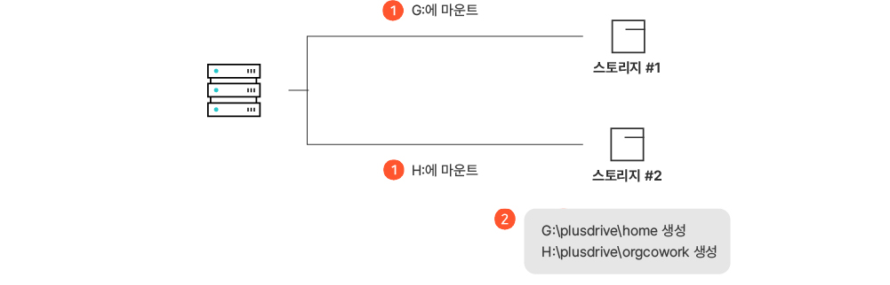

# 스토리지 마운트(Storage Mount) 방법

스토리지 마운트(Storage Mount)란 스토리지를 드라이브나 폴더에 연결하여 실제 입출력이 가능하도록 준비하는 것입니다. 여기서는 스토리지를 마운트한 후에 데이터 저장을 위한 폴더를 추가로 생성하고 데이터베이스에 등록하는 절차에 대해 설명합니다.


문서중앙화 솔루션에서는 **파티션(partition)**&#xC744; 자체적으로 정의하여 사용합니다. 파티션이란 스토리지 분할 공간입니다. 한 개의 스토리지가 한 개 또는 여러 개의 파티션이 될 수 있습니다.

파티션의 종류는 다음과 같이 3가지가 있습니다.

* **개인문서함용 파티션**: 여러 개인 사용자(개인 문서함)를 수용할 수 있습니다.
* **부서문서함용 파티션**: 여러 부서문서함(예: 전사 문서함, 영업팀 문서함, 마케팅팀 문서함, …)을 수용할 수 있습니다.
* **도메인용 파티션**: 여러 도메인(예: 삼성전자, 마이크로소프트, …)을 수용할 수 있습니다.


### <mark style="color:$primary;">싱글 도메인의 경우</mark>

싱글도메인으로 설치한 경우입니다. 멀티도메인으로 설치했지만 기본 도메인을 사용하는 경우에도 해당합니다.

#### 리눅스에서 스토리지 마운트

싱글도메인의 경우 개인문서함은 ‘/plusdrive/home’에서 관리하고, 부서문서함은 ‘/plusdrive/orgcowork’에서 관리하는 것을 기준으로 설명합니다.&#x20;

리눅스 서버에서 스토리지 마운트 방법은 3가지가 있습니다.&#x20;

**1) 스토리지를 마운트한 후 심볼릭 링크 설정**

<figure><figcaption></figcaption></figure>

**2) 개인문서함, 부서문서함 각각에 스토리지 한 개씩을 마운트하는 경우**

<figure><figcaption></figcaption></figure>

**3) 개인문서함, 부서문서함을 하나의 스토리지 내에 생성하는 경우**

<figure><figcaption></figcaption></figure>

#### Windows에서 스토리지 마운트

Windows서버에서 스토리지 마운트 방법은 2가지가 있습니다.


Windows서버에서는 파티션을 입력할 때 리눅스와 달리 파티션의 이름 앞에 ‘**드라이브명**\_’를 붙여서 입력합니다. 예를 들어 리눅스에서는 **home**으로 입력하지만 Windows에서는 ‘D’ 드라이브를 사용할 경우 **d\_home**으로 파티션을 입력합니다.


\
**1) 개인문서함, 부서문서함을 하나의 스토리지 내에 생성하는 경우**

<figure><figcaption></figcaption></figure>

**2) 개인문서함,** **부서문서함 각각에 스토리지 한 개씩을 마운트하는 경우**

### <mark style="color:$primary;">멀티도메인의 경우</mark>

멀티도메인으로 설치한 경우, 추가 도메인 등록을 위한 설정에 대해 설명합니다. 추가 도메인의 경우에는 도메인용 파티션만 등록합니다.  보통은 기본 도메인을 함께 사용하는데, 이 경우 앞에 설명한 싱글도메인용 파티션 등록도 필요합니다.

#### 리눅스에서 스토리지 마운트

리눅스 서버에서 스토리지 마운트 방법 2가지 사례를 설명합니다.&#x20;

**1) 도메인을 하나의 스토리지 내에 생성하는 경우**

<figure><figcaption></figcaption></figure>

**2) 도메인을 두 개의 스토리지에 각각 생성하는 경우**

<figure><figcaption></figcaption></figure>

#### Windows에서 스토리지 마운트

리눅스의 경우와 거의 유사하며, 윈도우 서버의 파티션 네이밍 방법은 본 아티클의 **싱글도메인의 경우**의 [**Windows에서 스토리지 마운트**](storage-mount.md) 목차 내용을 참고하세요.\
​\
다음 동영상에서 스토리지 마운트 방법에 대한 자세한 설명을 확인할 수 있습니다.



