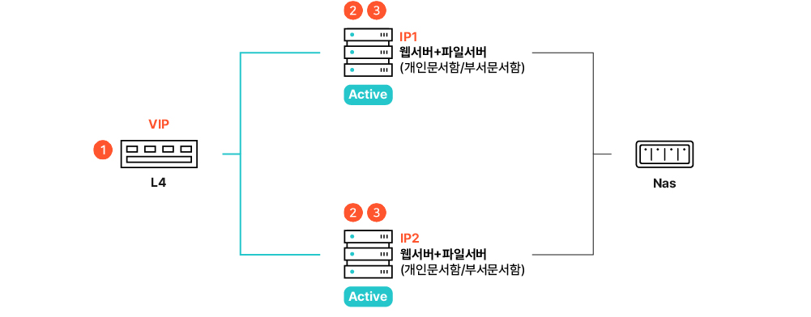
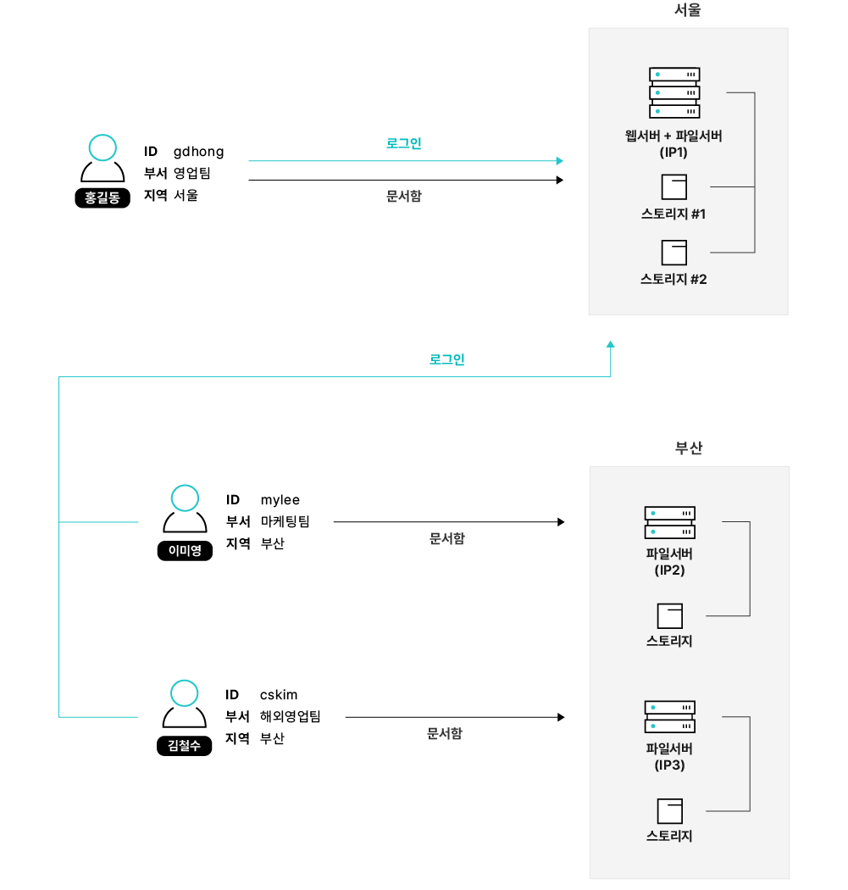
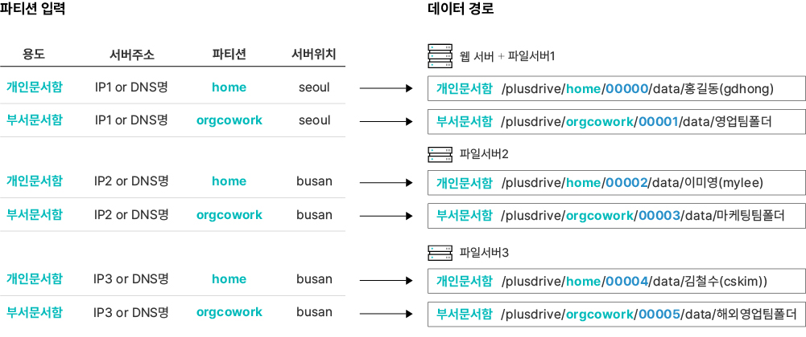
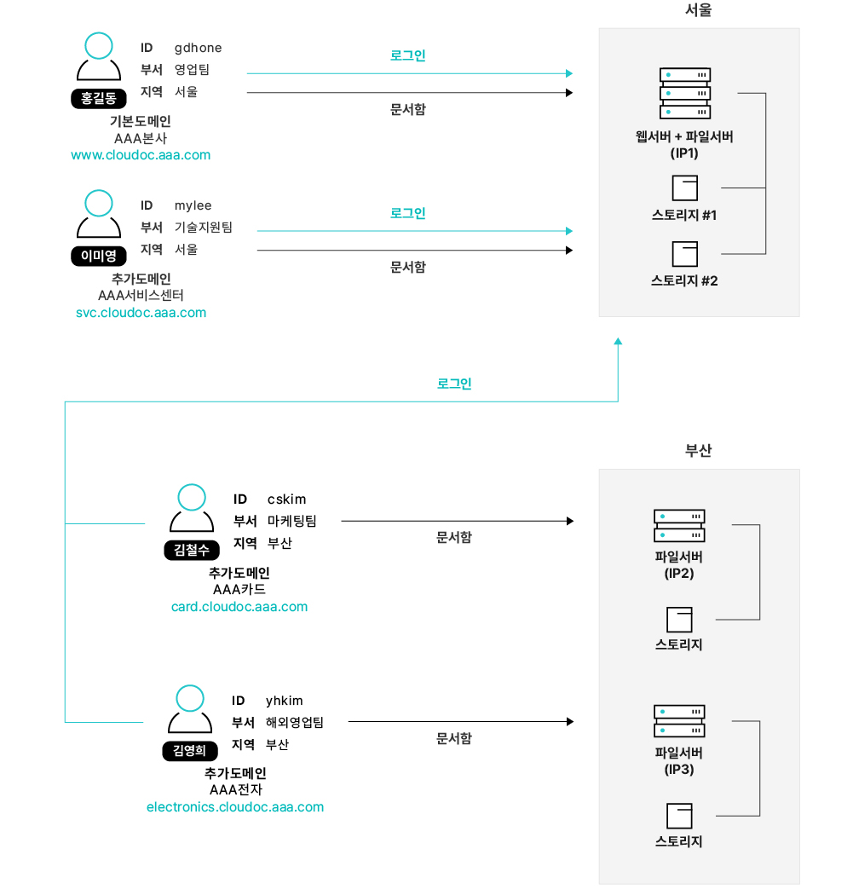
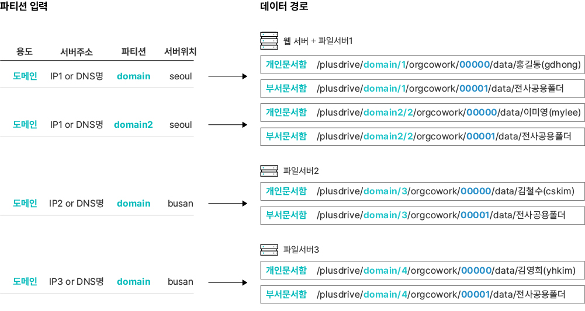

# 시스템 구성별 파티션 정보 등록 방법

​여기서는 시스템 구성별로 파티션 정보 등록 방법에 대한 예시를 확인할 수 있습니다.

### <mark style="color:$primary;">기본 파티션 정보 등록 방법</mark>

#### 이중화 없는 구조

파티션의 정보 등록은 실제 서비스에서 사용자들이 자신이 이용할 서버의 위치로 접속하기 위해 필요합니다. 개인문서함과 부서문서함의 인터넷 주소와 파티션 이름을 서버의 위치와 함께 등록합니다.\
기능별 분산 구성 예시는 아래와 같습니다.

.jpg>)

.jpg>)

#### Active-Passive 구조

Fault Tolerance 구성의 예시는 아래와 같습니다.

.jpg>)

.jpg>)

#### Active-Active 구조

<mark style="color:$primary;">**L4 스위치 이중화**</mark>

아래 구성에서는 파티션 등록의 3가지 항목에 대해 설명합니다.

* **문서함 등록**: 사용자 서비스만을 목적이면 아래 그림에서 L4 스위치가 가지고 있는 IP주소(VIP )에등록만 하면 충분합니다.  (그림에서 번)
* **웹서버 IP등록**: 시스템 내부적으로 서버간 정보 전달을 위해 웹서버의 실제IP 추가 등록이 필요합니다. (그림에서  번)
* **파일서버 IP 등록**: 시스템 내부적으로 서버간 정보 전달을 위해 파일서버의 실제 IP 추가 등록이 필요합니다. (그림에서  .png>)  번)

Fault Tolerance & Load Balancing 구성의 예시는 아래와 같습니다.

.jpg>)

* **문서함 등록** (번)

> L4 스위치를 이용한 이중화 구성에서 사용자들은 L4 스위치가 가지고 있는 IP주소(VIP) 또는 DNS이름을 이용하여 접속합니다.  따라서 개인문서함/부서문서함 파티션 정보는 VIP와 함께 등록합니다.

* **웹서버의 실제 IP를 등록하는 이유** (번)

> 관리자가 웹서버에 접속하여 보안 정책을 업데이트 하거나 사용자의 반출 신청&승인 등으로  업데이트가 필요한 경우, 접속한 웹서버 이외의 다른 웹서버로 ‘보안 정책 캐시’를 전파하기 위해 등록합니다.

* **파일서버의 실제 IP를 등록하는 이유** (번)

> 모든 파일서버에 캐시업데이트(폴더 권한 캐시, 문서 보안 등급 캐시)를 하기 위해서입니다. 파일서버에 캐시 업데이트가 필요할 때 VIP를 사용하면 일부 서버에만 업데이트가 랜덤으로 됩니다. 모든 파일서버의 업데이트를 위해 각 서버의 실제 IP를 등록합니다.
>
> * **부서문서함 용도로 파티션을 등록하는 이유**
>
> > 개인문서함 용도로 파티션을 등록하면 파티션에 전혀 사용하지 않을 개인문서함 아이디 폴더가 자동으로 생성되지만 부서문서함 용도로 등록한 경우에는 파티션에 변화가 없기 때문에 부서문서함 용도로 파티션을 등록합니다. 이때 파티션은 실제 사용하지 않을 이름으로 사용중인 파티션 이름(orgcowork)과 중복되지 않도록 file을 등록하였습니다. 한 서버에 개인문서함, 부서문서함이 다수 존재하여도, 파티션은 한 개 (예, file)만 등록합니다. 실제IP에 기반한 캐시업데이트만이 목적이기 때문에, 모든 파티션 정보가 필요하지는 않습니다.
>
> * **문서함수용여부 옵션**
>
> > 이 파티션은 실제 문서함으로는 사용하지 않습니다. 오직 시스템 운용에 필요 캐시 파일 전파용으로만 사용하기 때문에 파티션의 옵션 사항인 문서함수용여부는 수용  안 함을 선택합니다

<mark style="color:$primary;">**DNS RR(Round-Robin) 이중화**</mark>

L4 스위치의 경우와 동일한 이유로 **웹서버 IP**(그림)와 **파일서버 IP**(그림)의 파티션 정보 등록이 필요합니다.

L4가 아닌 DNS RR(Round-Robin) 구성의 예시는 아래와 같습니다.

* **문서함 등록** (번)

> L4가 아닌 DNS RR(Round-Robin)으로 웹서버를 이중화한 구성에서는 서버 주소는 IP 주소가 아닌 DNS명을 이용해야 합니다.  DNS Round Robin이라는 방식이 IP 주소를 사용하지 않고 DNS 이름을 이용하기 때문입니다.

* **웹서버의 실제 IP를 등록하는 이유** (번)

> 본 아티클의 Active-Active 구조 - L4 스위치 이중화를 참고하세요.

* **파일서버의 실제 IP를 등록하는 이유** ( 번)

> 본 아티클의 Active-Active 구조 - L4 스위치 이중화를 참고하세요.

### <mark style="color:$primary;">고급 파티션 정보 등록 방법</mark>

이제 서버가 여러 지역에 분산 배치된 경우의 파티션 정보 등록 방법을 보도록 하겠습니다.

#### 싱글도메인: 지역별 분산 구성 (파일서버\[서울], 파일서버\[부산])

각 지역별로 모든 서버가 개인문서함과 부서문서함 서비스를 하는 경우입니다. 사용자는 되도록 가까운 위치의 서버에 있는 개인문서함과 부서문서함을 이용하도록 설정할 수 있습니다.


위 그림에서는 편의상 영업팀폴더, 마케팅팀폴더, 해외영업팀폴더 등은 모두 팀의 부서문서함이 아닌 전사용 부서문서함에 생성함을 가정하였습니다. 팀용 부서문서함을 이용하는 경우 부서문서함 아이디는 팀용의 부서코드를 포함하여 길어집니다.

&#x20;  예) **전사용** 부서문서함에 사용자가 수동으로 만든 ‘**해외영업팀폴더’**

&#x20;        **/plusdrive/**<mark style="color:red;">**orgcowork**</mark>**/**<mark style="color:blue;">**00005**</mark>**/data/해외영업팀폴더**

&#x20;  예) **팀용** 부서문서함에 사용자가 수동으로 만든 **‘해외영업팀폴더’**

&#x20;         **/plusdrive/**<mark style="color:red;">**orgcowork**</mark>**/**<mark style="color:blue;">**100000116587377052410000**</mark>**/ data/해외영업팀폴더**


위 구성의 예와 같이 같은 지역에 동일 유형의 파티션이 복수 개인 경우, 시스템은 파티션 선택 알고리즘을 적용하여 가용공간이 가장 큰 파티션에 개인문서함(예.홍길동의 폴더) 혹은 부서문서함(예.마케팅팀 부서문서함)을 할당합니다. 자세한 내용은 [**사용자/부서문서함 생성 시 파티션 할당 알고리즘**](undefined-3.md)을 참조하세요.&#x20;

#### 멀티도메인: 지역별 분산 구성 (파일서버\[서울], 파일서버\[부산])

여러 지역에 서버가 분산 배치된 구조입니다. 기업을 가까운 서버에 할당하여 서비스할 수 있습니다. 여기서는 추가도메인 할당을 위한 도메인(domain) 파티션 등록만 설명합니다. 보통은 기본 도메인을 함께 사용하는데, 이 경우 앞에 설명한 싱글도메인용 파티션 등록도 필요합니다.

