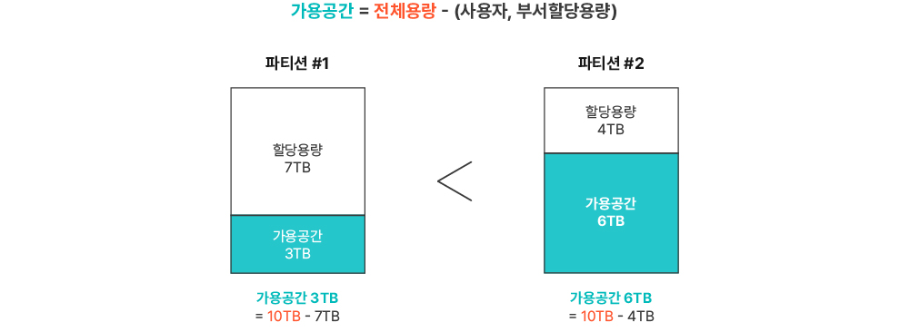
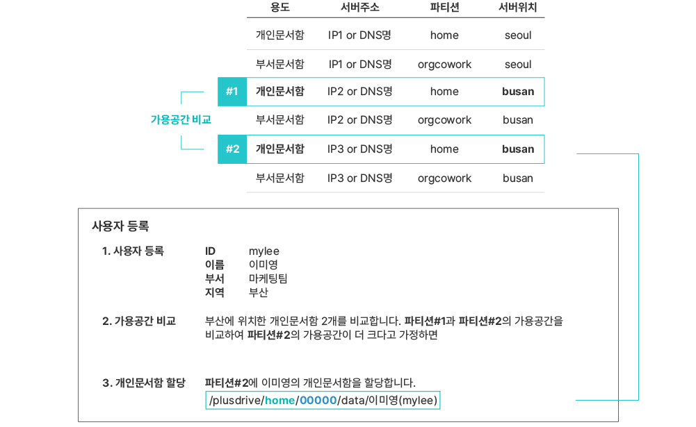
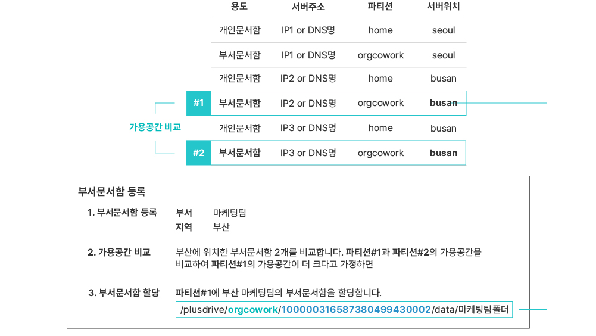

# 사용자/부서문서함 생성 시 파티션 할당 알고리즘

​사용자 또는 부서문서함을 생성할 때파티션 할당 알고리즘은 다음과 같습니다.

동일 용도의 문서함 파티션이 복수 개인 경우 **가용공간**을 비교하여 가장 큰 가용공간에 문서함을 할당합니다. 가용공간은 물리적 가용공간이 아니라 파티션 전체 용량에서 사용자 또는 부서문서함에 최대 사용가능으로 할당한 용량을 제외한 용량입니다.

예) **파티션 #1**과 **파티션** **#2**의 용량이 10TB로 같다고 가정할 때 **파티션** **#2**의 **가용공간**이 더 큽니다. 

<figure><figcaption></figcaption></figure>

파티션에는 **서버 위치(서버가있는** **지역)** 정보가 있습니다. 만약 파티션이 여러 지역에 존재하면 사용자나 부서문서함을 생성할 때 **서버 위치를 지정**합니다. 이때에 해당 서버 위치(지역)에 동일 용도의 문서함 파티션이 복수 개 존재하면 해당 파티션만을 대상으로 가용공간을 비교하여 자동으로 할당합니다.

#### <mark style="color:$primary;">사용자 등록할 때 파티션 설정</mark>

같은 지역에 파티션이 여러 개가 있을 경우에는 개인문서함 중에서 가장 큰  <mark style="color:red;">**주1)**<mark style="color:red;"> **가용공간**을 보유한 곳에 사용자의 개인문서함을 할당합니다.

**파티션 입력**

<mark style="color:red;">**주1)**<mark style="color:red;">**&#x20;가용공간 = 전체용량 – 사용자 할당용량**

파티션의 **가용공간**은 물리적 가용공간이 아니라 **파티션 전체 용량**에서 사용자들에게 **최대 사용가능으로 할당한 용량**을 **제외**한 용량입니다.

#### 부서문서함 등록할 때 파티션 설정

같은 지역에 파티션이 여러 개가 있을 경우에는 부서문서함 중에서 가장 큰 <mark style="color:red;">**주2)**<mark style="color:red;">**가용공간**을 보유한 곳에 부서문서함을 할당합니다.

**파티션 입력** 

<figure><figcaption></figcaption></figure>

<mark style="color:red;">**주2)**<mark style="color:red;">**&#x20;가용공간 = 전체용량 – 부서문서함 할당용량**

파티션의 **가용공간**은 물리적 가용공간이 아니라 **파티션 전체 용량**에서 부서문서함들에게 **최대 사용가능으로 할당한 용량**을 **제외**한 용량입니다.
